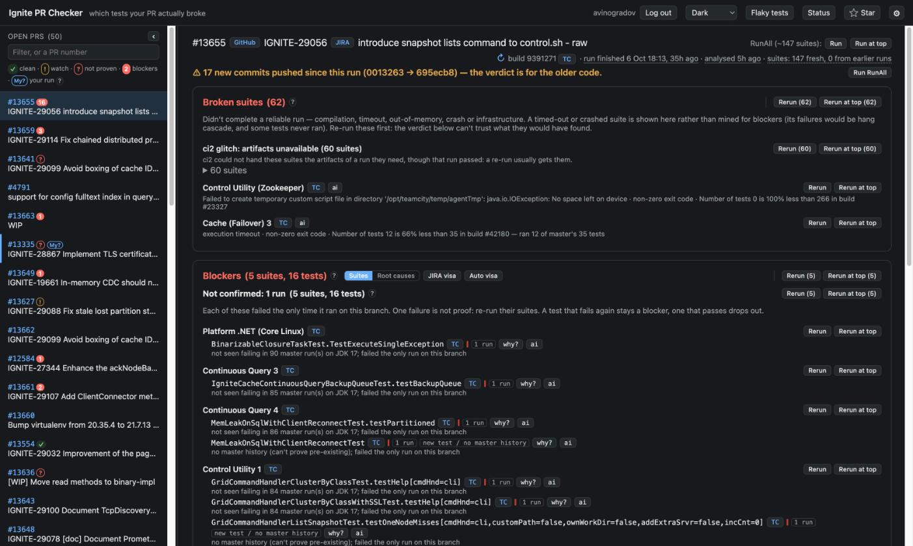

# Ignite PR Checker

**English** · [Русский](README.ru.md)

Ignite PR Checker answers one question for an [Apache Ignite](https://github.com/apache/ignite) contributor: which
test failures in my pull request's run did my change cause? It reads the project's TeamCity, ci2, compares each failure
with master and with other PRs, and filters out what they explain, with the reason for each. From the same page you
start RunAll, re-run suites, and post the verdict to the JIRA ticket or the pull request.

There is no database and no shared TeamCity account. Every user works under their own ci2 token, and the state is a
few JSON files on disk.

➡ **Live instance: <https://ignite-pr-checker.is-a.dev>**. Log in with your ci2 access token.

➡ **[Feature tour](docs/features.md)**. It starts with the [verdict glossary](docs/features.md#verdict-glossary): what
each label means and what to do about it.



## What it does

- **The verdict.** The PR page splits the failures of the PR's latest RunAll into blockers, tests to watch, broken
  suites and filtered-out noise, with a reason under each test. See
  [Reading the verdict](docs/features.md#reading-the-verdict).
- **Runs.** Run RunAll or rerun suites from the page, at the top of the ci2 queue if you are in a hurry. The runs row
  shows what is queued and running, with estimates; **Cancel my runs** stops yours. See
  [Iterating on a fix](docs/features.md#iterating-on-a-fix).
- **Standing options.** In ⚙: auto re-run of failed suites, a JIRA visa or a PR comment for each of your runs, a
  checkstyle autofix, PR commands. They work while the page is closed. See
  [Standing options](docs/features.md#standing-options).
- **PR commands.** With **PR commands** on, a `/run-all` comment on any pull request queues RunAll under your TeamCity
  account, and the comment then tells how the run goes. See
  [Working from the PR](docs/features.md#working-from-the-pr-commands).
- **The flaky board** at `/flaky.html`: tests that fail on master, flaky ones first, then the ones that broke. See
  [The fix-master queue](docs/features.md#the-fix-master-queue-flakyhtml).
- **The status page**: health, memory, the warmer, TeamCity, GitHub and JIRA calls, the settings in effect. Live:
  <https://ignite-pr-checker.is-a.dev/status.html>.

## How a failure becomes a blocker

Each failed test is judged in each suite on its own. The same test can run in several suites (the C++ tests run on
Windows, Linux and Clang), and a pass on one platform says nothing about another.

A failed test is a **blocker** when all of these hold:

- **The branch keeps failing it.** It failed in each of its last 3 finished runs in that suite on the PR branch, or in
  every run when there were fewer: on a PR's first RunAll one failure is enough. Failing every run of the PR's current
  revision, two or more, counts too. Each run is matched to the revision it built, so a pass on older code does not
  clear a failure.
- **Master does not explain it.** It did not fail in the last 100 runs of that suite on master on the PR's JDK. A
  master failure makes the test pre-existing, unless that failure is rare and old (at most 2% of the runs, none of the
  newest 10) and the PR's failures in a row are too many to be chance, or master fails it only at a
  `TEST_SCALE_FACTOR` the PR did not run at.
- **Other PRs do not explain it.** It does not fail on the branches of 3 or more other PRs, unless the PR's failures in
  a row outweigh their rate.

A first failure on new code, or a test that started failing after a pass on the same code, goes to **Recently started
failing**: a re-run decides. Everything else is filtered out with its reason. Suites with no reliable result (a
compilation error, a timeout, a crash, a failed build step) are listed apart as broken suites. The
[glossary](docs/features.md#verdict-glossary) has every reason and threshold.

## Accounts and tokens

- **Users** log in with their own ci2 access token. It travels encrypted (AES-GCM) in an HttpOnly session cookie, and
  the runs a user starts or cancels on the page go under their account. For about an hour after a user's last request
  the server also holds the token in memory and uses it only to read from TeamCity, to pre-analyse open PRs for
  everyone. A login lasts until logout.
- **Standing options** store the tokens they need while they are on, encrypted with `SESSION_SECRET`: the TeamCity
  token, the user's JIRA token for visas, and the user's GitHub token for PR comments and the checkstyle autofix.
- **The app account** is the GitHub account of `GITHUB_TOKEN`. The checker reads GitHub under it and writes as it: the
  replies to commands of users who have not switched PR commands on, reactions, hints, the run story of users without
  their own GitHub token, and the mention that tells such a user their verdict is ready. Use a separate account with no
  rights in `apache/*` and a classic token with the `public_repo` scope: a leaked token then cannot push to Apache
  Ignite. The status page shows whose token it is and warns if that account can push to the repo.

There is no shared JIRA account: visas go out under the JIRA token of the user they are for.

## Quick start

**Use it.** Open <https://ignite-pr-checker.is-a.dev> and log in with a ci2 access token (TeamCity: Profile → Access
Tokens). Pick a PR on the left, or type its number in the filter.

**Run your own instance** on Debian or Ubuntu, as root:

```bash
curl -fsSL https://raw.githubusercontent.com/anton-vinogradov/ignite-pr-checker/main/install.sh | sudo bash
```

Then point a DNS name at the host, serve the service through an HTTPS proxy, set `APP_PUBLIC_URL` in
`/etc/ignite-pr-checker/env` and restart the service; the installer prints these steps. Bind the service to loopback
(`SERVER_ADDRESS=127.0.0.1`, as the env template has it) and serve it through the proxy only: users paste tokens into
its login form. A minimal `Caddyfile`, which also compresses the large JSON answers:

```
prc.example.org {
	encode zstd gzip
	reverse_proxy 127.0.0.1:8080
}
```

**Develop** with JDK 17:

```bash
./gradlew bootRun   # http://localhost:8080, the dev profile
./gradlew test
```

## Configuration

Settings are environment variables in `/etc/ignite-pr-checker/env`; restart the service after a change. The defaults
target Apache Ignite's ci2. Each start logs the settings in effect (`effective config: …`), and the status page lists
them for signed-in viewers. A value out of range falls back to its default, and the status page warns about it.
`install.sh` writes the env file from a template once and never touches it again: on an existing install, add new
settings by hand.

| Variable | Default | What for |
|---|---|---|
| `APP_PUBLIC_URL` | `https://ignite-pr-checker.is-a.dev`; empty in the env template | The https address users open. Links in PR comments, JIRA visas and replies point here. Set it on any other instance: while it is empty, the status page warns. |
| `SERVER_ADDRESS` | all interfaces; `127.0.0.1` in the env template | Where the service listens. Keep `127.0.0.1` behind an HTTPS proxy. |
| `SERVER_PORT` | `8080` | The port. |
| `SESSION_SECRET` | a random key per start; `install.sh` writes a stable one | Encrypts the session cookies and the stored tokens. Read [The cache directory](#the-cache-directory) before you change it. |
| `SESSION_COOKIE_SECURE` | `false`; `true` in the env template | Send the session cookie over HTTPS only. Set `false` only for a test install on plain HTTP. |
| `GITHUB_TOKEN` | none | Token of the app account: a separate GitHub account with no rights in `apache/*`, a classic token with the `public_repo` scope. Without it GitHub is read at most 60 times an hour and nothing is posted under the checker's own account. |
| `PRC_ADMINS` | none | TeamCity usernames of the operators, comma-separated. See [Who may restart, update and flush](#who-may-restart-update-and-flush). |
| `JAVA_OPTS` | none | Extra JVM flags; `run.sh` puts them after its defaults, e.g. `-Xmx768m`. See [Memory](#memory). |
| `TC_BASE_URL` | `https://ci2.ignite.apache.org/` | The TeamCity to read, with a slash at the end. |
| `TC_RUN_ALL_BUILD_TYPE` | `IgniteTests24Java8_RunAll` | The build type of the RunAll chain. |
| `GITHUB_REPO` | `apache/ignite` | Whose PRs are listed and checked. |
| `JIRA_BASE_URL` | `https://issues.apache.org/jira` | Where visas go and IGNITE ticket links point. |
| `MASTER_HISTORY_DEPTH` | `100` | Master runs of a test looked at, per suite. |
| `BLOCKER_FAIL_STREAK` | `3` | Failed branch runs in a row for a blocker. |
| `ANALYSIS_BASE_BRANCH` | `refs/heads/master` | The branch PR failures are compared with. |
| `ANALYSIS_CONCURRENCY` | `8` | TeamCity calls one analysis makes in parallel. |
| `ANALYSIS_CACHE_TTL_MINUTES` | `120` | How long a test's history and a verdict stay cached. |
| `ANALYSIS_REFRESH_AFTER_SECONDS` | `120` | A viewed verdict older than this asks TeamCity whether anything finished on the branch, and is recomputed if so. |
| `WARM_ENABLED` | `true` | Keep the newest open PRs analysed in the background. |
| `WARM_COUNT` | `50` | How many PRs. |
| `WARM_INTERVAL_MINUTES` | `10` | How often. |
| `WARM_TOKEN_TTL_MINUTES` | `60` | How long a user's token stays in the pool after their last request. |
| `AUTOMATION_ENABLED` | `true` | Let standing options and PR commands act in the background. |
| `PRC_PERSIST_ENABLED` | `true` | Keep state and caches on disk. |
| `PRC_CACHE_DIR` | `/opt/ignite-pr-checker/cache` | Where. |
| `PERSIST_INTERVAL_MINUTES` | `5` | How often the caches are written; state is written within a second of a change. |
| `UPDATE_ENABLED` | `true` | Offer the **Update** button. |
| `UPDATE_JAR_PATH` | `/opt/ignite-pr-checker/app.jar` | The running jar; the update request and `update-failed` sit beside it. |
| `PRC_LOG_FILE` | none, console only; the unit sets `/opt/ignite-pr-checker/logs/ignite-pr-checker.log` | The service's own log: a file a day, 30 days, at most 500 MB of old files. |
| `GITHUB_CACHE_SECONDS` | `300` | How long the list of open PRs is cached. |
| `TEAMCITY_READ_TIMEOUT`, `GITHUB_READ_TIMEOUT`, `JIRA_READ_TIMEOUT` | `60s` | How long a call may wait without data. |
| `GITHUB_API_URL` | `https://api.github.com` | For tests only. |
| `PRC_JAVA` | set in the unit by `install.sh` | The java `run.sh` starts. |

## Operation

### Install and update

`install.sh`, the one-liner above, installs the latest release or updates an existing install to it. Re-run it to get
new versions of the scripts and the systemd unit, not only of the jar. It:

- uses the `java` on the PATH if it is 17 or newer, and installs OpenJDK 17 otherwise;
- creates the `prc` service user. `/opt/ignite-pr-checker` with the jar and the scripts belongs to root, so the service
  cannot change the code it runs; it writes only to `cache/`, `update/`, `dumps/` and `logs/` there;
- writes `/etc/ignite-pr-checker/env` from the template, with a generated `SESSION_SECRET`, if the file is not there;
- writes `update.sh`, `run.sh` and the unit `ignite-pr-checker`, installs the latest release through `update.sh`,
  starts the service and waits up to 60 s for it to answer.

**Update from the page.** When a newer release is out, the top bar shows **Update to vX.Y.Z** and a **what's new** link
to its release notes, or to the list of releases when it is not the next patch release. The button restarts the
service. Before the start, systemd runs `update.sh` as root, which:

- downloads exactly the release the button offered;
- installs it only if its sha256 equals the digest GitHub lists for the release's `ignite-pr-checker.jar`;
- keeps the jar it replaces as `app.jar.prev`, unless it is the same jar;
- on a failure keeps the current jar and writes the reason to `/opt/ignite-pr-checker/update-failed`. The button then
  reads **Retry update to vX.Y.Z**, with the reason in its tooltip. The service starts either way.

**Install a given version.** `install.sh` always takes the latest release; `update.sh` installs the one you name, an
older one too:

```bash
sudo /opt/ignite-pr-checker/update.sh 1.23.1 && sudo systemctl restart ignite-pr-checker
```

**Roll back** to the jar that ran before the last update, install or deploy:

```bash
cd /opt/ignite-pr-checker && sudo cp app.jar.prev app.jar && sudo systemctl restart ignite-pr-checker
```

The first start of a new build copies each state file to `<file>.before-<version>-built-<time>`. To undo what a bad
release wrote, stop the service, copy that file over the state file, and start the old jar.

### Service and logs

```bash
sudo systemctl status ignite-pr-checker
sudo systemctl restart ignite-pr-checker   # after a change in /etc/ignite-pr-checker/env
journalctl -u ignite-pr-checker -f
sudo tail -f /opt/ignite-pr-checker/logs/ignite-pr-checker.log
```

The service's own log keeps 30 days, a file a day. The status page keeps the recent warnings and errors across
restarts and lists at the top what is wrong now: a background job that stopped, a state file it could not read, a
setting out of range.

### Memory

The JVM gets `-Xmx512m`. A JVM out of memory writes a heap dump to `/opt/ignite-pr-checker/dumps/` and exits, and
systemd starts it again; `run.sh` keeps only the newest dump. A dump holds decrypted tokens, so only the service can
read that directory. For more heap, set `JAVA_OPTS=-Xmx768m` in the env file and restart. The status page shows the
heap with the peak of its old generation, and the process's resident memory with its peak.

### The cache directory

`/opt/ignite-pr-checker/cache` (`PRC_CACHE_DIR`) belongs to `prc`, mode 700:

| File | What it holds |
|---|---|
| `standing-visas.json` | Each user's standing options, their stored TeamCity, JIRA and GitHub tokens (encrypted), GitHub logins, the comments and visas the options follow, the re-run waves. |
| `visa-subs.json` | Armed one-shot Auto visas, each with its JIRA token (encrypted). |
| `pr-commands.json` | The PR command poll: handled comments, run stories, who got the onboarding reply. |
| `reruns.json` | Queued and running builds the page and the options follow. |
| `admin-actions.json` | The last restart, update and flush: who and when. |
| `problems.json` | Recent warnings and errors for the status page. |
| `users.json` | Who used the service and when. Names only, no tokens. |
| `analysis.json`, `flaky.json`, `suite-baseline.json`, `delta.json`, `github.json`, `metrics.json` | Caches: verdicts and what TeamCity said, the flaky board, master's test counts, run-to-run deltas, the open PRs, the status page's counters. Without them the service starts slower. |
| `merged/<pr>.json` | The verdict of a merged PR as it stood at the merge. Written once, never removed. |
| `backups/cache-YYYY-MM-DD.zip` | All snapshot files, zipped once a day, the newest 7 kept. `merged/` is not in them. |
| `<file>.bad-<time>` | A file that could not be read at the start, set aside; that part started empty. |
| `<file>.before-<version>-built-<time>` | A file as it was before a new build first ran; the newest 5 kept per file. |

State is written within a second of a change, the caches every 5 minutes, and everything at shutdown.

The tokens in these files, the backups included, are encrypted with `SESSION_SECRET`. Changing the secret logs
everyone out and makes the stored tokens unreadable. Armed Auto visas are dropped. Standing options stay on but do
nothing until their owner logs in again, which stores a fresh TeamCity token; auto-visa, the PR comment and the
autofix also need their owner to switch them off and on with a fresh JIRA or GitHub token. Change the secret only if
it leaked.

### Who may restart, update and flush

With `PRC_ADMINS` set, only those TeamCity users may press **Restart service**, **Update** and **Flush caches** and
see the list on the **Users** tab; the buttons are hidden from everyone else. Without it, any logged-in user may, but
restart and update at most once per 10 minutes between them, and flush at most once per hour. Every press is logged
with the user's name, and the status page shows who restarted and who flushed last.

### Releases

CI builds a release from a tag:

```bash
git tag v1.24.0 && git push origin v1.24.0
```

The release workflow runs all the tests and publishes the jar as `ignite-pr-checker.jar`. Its notes are made of the
**What changes for users** section of each PR merged since the previous tag, with a warning when `TestVerdict.RULES`
changed: every verdict is then computed again after the update.

For the maintainer: fill **What changes for users** in each PR (the template has it), release a change of the verdict
rules as a minor version, and put small PRs into one release.

### Shipping a local build

`deploy.sh` builds and tests the jar on your machine, copies it over SSH (`PRC_SSH_HOST`, by default `ignite-prc`) and
restarts the service. It refuses uncommitted changes to what goes into the jar (`--force` ships a build versioned
`…-dirty`). It keeps the replaced jar as `app.jar.prev` only if that jar was answering, waits up to 60 s for the new
version, and prints the rollback command if it does not come up.

## Architecture

One Spring Boot application; the packages under `com.github.igniteprchecker`:

| Package | What it does |
|---|---|
| `tc` | The TeamCity REST client, always under the caller's token, and `RerunTracker`, which follows queued and running builds. |
| `analysis` | The verdict: `ChainCollector` walks the RunAll chain, `BlockerAnalyzer` judges each failure, plus caveats, root causes, the flaky board, merged PRs' verdicts, and the warmer with its token pool. |
| `jira` | Verdict texts (`VisaService`), the standing options that settle runs with re-runs, comments and visas (`StandingVisas`), and one-shot Auto visas. |
| `github` | The GitHub client (PR list, comments, reactions, commits) and the PR command poll (`PrCommands`). |
| `style` | The checkstyle autofix of the author's own PR. |
| `web` | The HTTP API, login, operator actions, security headers. |
| `persist` | Snapshots of state and caches on disk, and their backups. |
| `health`, `metrics` | The status page: recent problems, health of the background jobs, call counters, memory. |
| `update` | The in-app update, which asks `update.sh` for a release. |
| `config`, `session` | Settings, and the encrypted session cookie. |

The pages are static files, `index.html`, `flaky.html` and `status.html`, with their code in `static/*.js` and the
shared helpers in `static/common.js`.

## Development

- `./gradlew bootRun` uses the `dev` profile: it listens on `127.0.0.1:8080`, keeps its state in `./build/prc-cache`,
  and neither warms PRs, nor acts on PRs in the background, nor updates itself. Opening a PR still analyses it on ci2
  under your token. To try the warmer: `WARM_ENABLED=true WARM_COUNT=3 ./gradlew bootRun`.
- `./gradlew test` runs the tests, the page scripts under node included (skipped without node), and writes a coverage
  report to `build/reports/jacoco/test/html`. CI runs `./gradlew build` and `node --check` on every page script.
- The docs come in pairs, English and Russian. Change both: `DocParityTest` checks they have the same sections and
  facts.

## License

Apache License 2.0, see [LICENSE](LICENSE).
