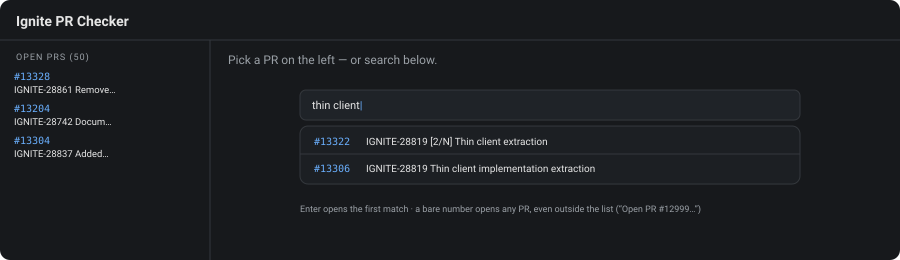
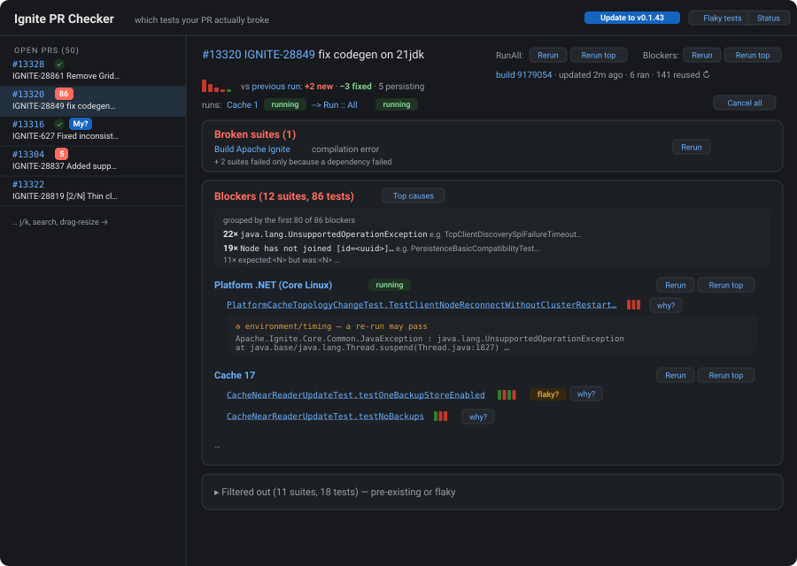
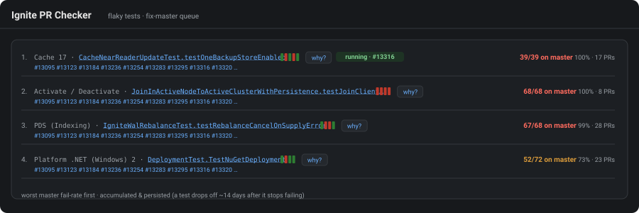
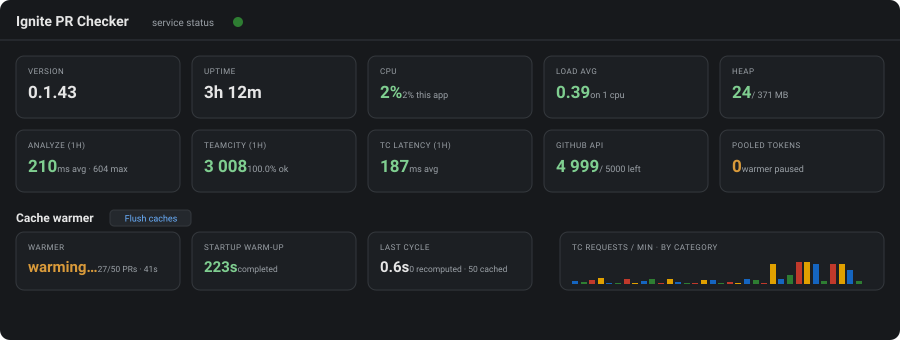

# Тур по возможностям

[English](features.md) · **Русский**

Что умеет Ignite PR Checker, экран за экраном. Картинки — схематичные макеты реального интерфейса
(тёмная тема; всего тем четыре — Light, Dark, JetBrains и Terminal — селектор в шапке).

## Найти свой PR

- Левая панель — **открытые PR** репозитория, свежеобновлённые сверху. Бейджи показывают последний
  известный вердикт: зелёная **✓** (нет блокеров), красное **число** блокеров или ничего (ещё не
  анализировался).
- Синий чип **My?** помечает PR, чей последний RunAll запускал *ты* (по имени пользователя TeamCity).
- Пока PR не выбран, **строка поиска** фильтрует список по номеру или подстроке заголовка; `Enter`
  открывает первое совпадение. Голый номер открывает **любой** PR — даже вне списка (`?pr=12345`
  в URL тоже работает).
- Панель можно **растягивать** (перетащить разделитель, дабл-клик — сброс) и **схлопывать** (`‹` / `›`).

## Прочитать вердикт

Главный вопрос, на который отвечает инструмент: **какие тесты этот PR сломал на самом деле?**

- **Blockers** — упал в последнем RunAll этого PR, чист в последних ~100 прогонах мастера **и падает
  устойчиво**: во всех последних N (по умолчанию 3) завершённых прогонах ветки, без прохода на том же
  коде. Сгруппированы по сьютам; каждое имя —
  ссылка прямо в падение на TeamCity.
- **Recently started failing** — янтарная карточка для тестов, падающих последние 2+ прогона, но
  проходивших раньше: свежая поломка «на карандаше». Продолжит падать — станет блокером; отфлапает
  назад — нет.
- Вердикт **живой**: пока более новый RunAll бежит (или закончился отменой), падения его уже
  завершившихся сьют вливаются в вид — тег *● includes an unfinished run* ведёт на ту цепочку.
  У прерванной цепочки — красный баннер *RunAll interrupted* (N сьют упало, M не запускались).
- **Filtered out** — всё остальное, каждое с причиной (`pre-existing: fails 39/95 on master`,
  `flaky on branch`, `passed on re-run`, …). По умолчанию свёрнуто — шум не мешает.
- **Broken suites** — сьюта без надёжного прогона (ошибка компиляции, **таймаут, out-of-memory,
  краш JVM**, упавшая зависимость) выводится отдельной красной карточкой, а не исчезает молча —
  даже если часть тестов в ней успела упасть: их падения — каскад зависания, а часть тестов вообще
  не бежала. Жертвы упавшей зависимости схлопнуты в одну строку.
- У каждого теста — **полоска pass/fail** его завершённых прогонов на ветке (старые → новые).
  Переход fail→pass даёт тег **flaky?**; ровное `▮▮▮` — стабильная поломка.
- **why?** раскрывает сообщение об ошибке на месте, с грубым триажем:
  `♻ environment/timing — a re-run may pass` против `⚖ assertion — likely a real logic failure`.
- У карточки блокеров два вида: **Suites** (по умолчанию) и **Root causes** — те же блокеры,
  перегруппированные по сигнатуре ошибки; каждая причина — спойлер со своими сьютами и тестами
  внутри. Сотни тестов обычно схлопываются в несколько причин; сьюта, сломанная двумя разными
  вещами, просто появится под обеими.
- `IGNITE-XXXXX` в заголовке PR — ссылка на тикет в ASF JIRA.

## Итерации над фиксом

- **vs previous run: +2 new · −3 fixed · 5 persisting** — дельта против предыдущего RunAll этого PR
  (имена тестов в тултипах), рядом — **спарклайн тренда**: столбик на прогон, красный пока есть
  блокеры, зелёный при нуле.
- **Перезапуски не выходя со страницы**: весь `RunAll`, любая **секция** (битые сьюты, блокеры,
  «недавно посыпался», отсев) или одна сьюта — каждое *обычно* или *в голову очереди*. Живые чипы
  **queued / running** загораются у затронутых сьют и в строке `runs:` с **queue-aware оценками
  финиша** (учитывают очередь агентов и реальный прогресс сьют). **Cancel all** снимает всё, что
  ты ставил.
- **JIRA-виза** — вердикт постится в `IGNITE-XXXXX`-тикет PR-а в классическом tcbot-стиле: в один
  клик сейчас, **Auto visa** (разово, сработает при финише текущего прогона) или опция в настройках
  (⚙) *Auto-visa all my runs* — виза для каждого твоего RunAll автоматически (только для прогонов,
  финишировавших после включения; каждый прогон визируется один раз).
- **Авто-перепрогон блокеров** (настройки, независимо от визы) — когда твой RunAll финиширует с
  блокерами **или сломанными сьютами** (таймаут, краш, компиляция), эти сьюты перепрогоняются
  автоматически, до 2 попыток: ≤10 сьют встают в начало очереди, больше — в хвост, чтобы не мешать
  остальным; системная поломка (30+) не трогается. Одноимённые сьюты, уже висящие в очереди,
  предварительно отменяются. Прошедший перепрогон снимает свой блокер — а сломанная сьюта, чей более
  свежий прогон прошёл, перестаёт быть сломанной. Если включена и виза — она ждёт, пока перепрогоны
  устаканятся; ⏳-строка живого комментария несёт queue-aware оценку **«≈ settled by HH:MM»**,
  обновляемую каждый свип.
- **Комментарий в GitHub-PR** (настройки, независимо от двух других) — тот же вердикт в
  GitHub-markdown постится в pull request `apache/ignite` от твоего собственного GitHub-аккаунта
  (personal access token со скоупом `public_repo`; пока опция включена, хранится зашифрованным).
  Весь прогон живёт в **одном комментарии**: он появляется по финишу RunAll, а если сработал
  авто-перепрогон — **редактируется на месте** (⏳ перепрогоняю → финальный вердикт), не плодя
  сообщений.
- Строка свежести показывает **состав прогона** — `6 ran · 141 reused`: перезапущенная цепочка на
  неизменённых ревизиях переиспользует старые сьют-билды (TeamCity подставляет пригодные
  результаты).
- Когда твои прогоны доезжают, анализ **обновляется сам** — без F5.

## Работа из PR (команды)

При включённой GitHub-опции весь цикл — запуск → прогресс → вердикт — проходит в pull request,
комментариями:

| Команда | Эффект |
|---|---|
| `/run-all` (или `/runall`) | ставит всю цепочку RunAll в очередь под **твоим собственным** TeamCity-токеном |
| `/run-all top` | то же, но цепочка встаёт в очередь **сразу в начало** (нативный `queueAtTop`) |
| `/top` | поднимает **прогон, запущенный твоей командой**, в начало очереди — только пока он ещё queued |

Семантика, зафиксированная:

- **Топ — часть команды.** Обе формы действуют на прогон, запущенный *твоей* командой; чужие билды
  на том же PR не трогаются никогда.
- **Подтверждение, а не болтовня**: реакция 🚀 = принято, 😕 = отказ или нечего делать. Детали —
  ссылка на поставленный TC-билд, затем живая строка **«~Xh Ym remaining — ≈ 21:05 MSK»**
  (queue-aware; абсолютное время в таймзоне твоего JIRA-профиля; обновляется каждые ~5 минут) —
  редактируются **в сам командный комментарий**; вердикт — **один** живой комментарий, который
  обновляется на месте по ходу авто-перепрогонов. Итого два сообщения на прогон.
- Команды подхватываются **в течение минуты** (один опрос комментариев на весь репозиторий
  покрывает все PR) и работают в **любом** pull request — командовать PR-ом значит запускать его
  под своими аккаунтами.
- Команда от ещё **не подключённого** пользователя получает разовый ответ — куда зайти и какую
  галку включить: команда сама себе onboarding.

## Очередь «чинить мастер» (`/flaky.html`)

Тесты, которые чекер отсеивает, потому что они **падают на мастере** — вина не какого-то PR, а
общий шум. Отсортированы по частоте падений на мастере (худшие сверху) с числом открытых PR,
которым каждый сейчас мешает. Статистика накапливается и персистится — переживает рестарты и
простои; тест выпадает из списка через ~14 дней после того, как перестал падать. Страница
публичная — читать можно без логина.

## Страница статуса (`/status.html`)

Публичное здоровье сервиса: CPU/load/heap со **светофорными** порогами, латентность собственных
эндпоинтов, метрики вызовов TeamCity/GitHub по категориям с поминутными графиками и блок
**обогревателя кэша** — греет ли он прямо сейчас (с живым прогрессом), сколько заняла стартовая
загрузка и что сделал последний цикл. **Flush caches** (только под логином) сбрасывает кэши
анализа и запускает фоновый повторный прогрев.

## Всё остальное

- **Самообновление**: при выходе релиза появляется кнопка **Update to vX.Y.Z** — один клик меняет
  jar и перезапускает сервис. После деплоя открытые вкладки показывают пилюлю **UI updated — reload**.
- На статус-странице есть вкладка **Users** (кто активен сейчас / кого видели — только под логином)
  и кнопка **Restart service** (оформлена как опасная, с подтверждением).
- **Персональная авторизация**: каждый входит со своим токеном TeamCity (шифруется в HttpOnly-куку;
  ни серверного хранилища сессий, ни общих учёток).
- **Четыре темы** — Light, Dark, JetBrains (плотная, статус-полосы) и Terminal (моноширинная,
  кнопки-скобки) — на браузер, без мигания при загрузке.
- Вся тяжёлая работа кэшируется и греется в фоне — PR открывается мгновенно.
