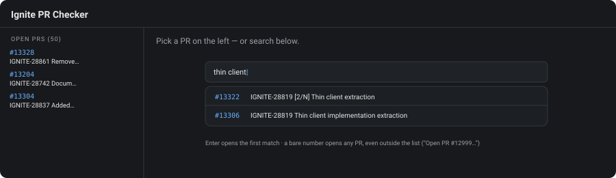
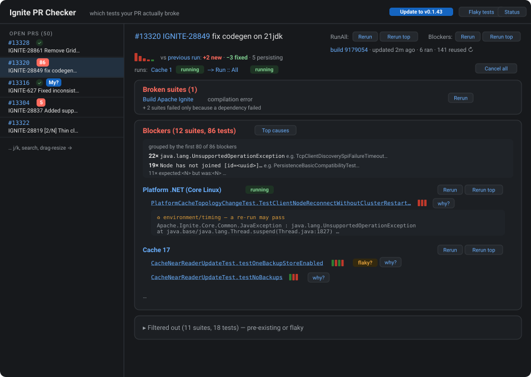
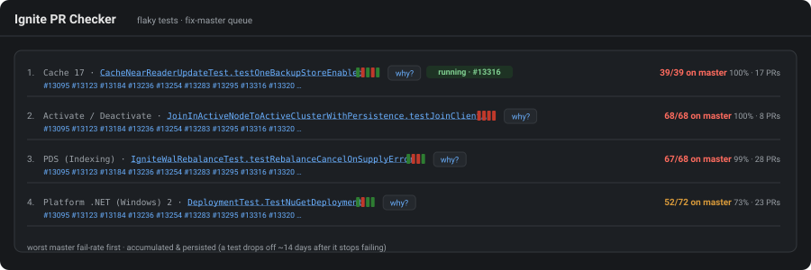
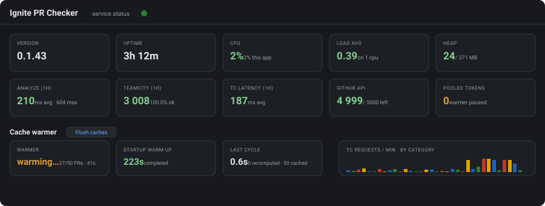

# Тур по возможностям

[English](features.md) · **Русский**

Что умеет Ignite PR Checker, экран за экраном. Картинки — схематичные макеты реального интерфейса
(тёмная тема; всего тем четыре — Light, Dark, JetBrains и Terminal — селектор в шапке).

## Словарь вердикта

Каждая метка, которую чекер ставит на PR, сьюту или тест: что она значит и что делать. Сюда ведут значки **?** на
странице, комментарий в PR и виза в JIRA. Числа — значения по умолчанию из кода, см. [Пороги](#пороги).

### Карточки на странице PR

| Карточка или заголовок | Что значит | Что делать |
|---|---|---|
| **Blockers** | Тесты, которые этот PR, скорее всего, сломал: они падают в его прогонах, и ни master, ни другие PR этого не объясняют. Каждая сьюта оценивается отдельно. Строка под тестом объясняет почему ([причины](#причины-под-тестом)). | Открой **why?** или **TC**, исправь код, запушь, запусти RunAll снова. |
| **Not confirmed: 1 run** | Блокеры, которые упали в единственном своём прогоне на этой ветке. Они всё равно считаются блокерами: в счётчике, в значке списка PR, в визе и в комментарии. | Нажми **Rerun** у их сьют. Второе падение подтверждает блокер, проход снимает его. |
| **Recently started failing** | Тесты, которые падают на текущем коде PR, но прогонов этого кода слишком мало, чтобы отличить поломку от флака. Пока не блокеры. | Нажми **Rerun** у сьюты. Продолжит падать — станет блокером, пройдёт — уйдёт из списка. |
| **Could not be checked** | Упавшие тесты, которые из-за ошибок TeamCity не удалось сравнить с master и веткой. Блокерами не считаются. | Ничего: чекер проверит их снова сам. |
| **Broken suites** | Сьюты без надёжного результата ([причины](#причины-битых-сьют)). Сьюта с таймаутом или падением JVM попадает сюда, а не разбирается на блокеры: её падения — каскад от зависания, и часть тестов не запустилась. | Перезапусти их первыми: вердикт не может доверять тому, что они нашли бы. |
| **Fewer tests than master** | Сьюты, которые прогнали минимум на 10% меньше тестов, чем та же сьюта на master; сравниваются только сьюты, где на master 20 тестов и больше. Незапущенный тест упасть не может. | Если PR удаляет тесты намеренно — ничего. Иначе сравни список тестов с master и перезапусти. |
| **Crashed near the end of the run** | Сьюты, которые упали по таймауту, из-за нехватки памяти или падения JVM, но уже прогнав больше 90% тестов master, и ни одно их падение не вменено PR. Их результаты в силе. | Для PR — ничего. |
| **⚠ Suites that never ran** | RunAll прервали: эти сьюты отменили, и они не запускались. Вердикт о них ничего не говорит. Сьюты, отменённые человеком, свёрнуты в одну строку на человека. | Нажми **Rerun** у них или запусти RunAll снова. |
| **This PR's tests** | Как в этом RunAll прошли тестовые классы, которые PR добавляет (`new`) или меняет (`changed`). Тест попадает в список, если упал, шёл дольше 60 с или, в изменённом классе, не имеет истории на master. | Проверь, что новые тесты запустились и прошли. У теста без истории на master судить можно только по этому прогону. |
| **Filtered out** | Падения, которые не ставятся в вину PR, у каждого своя причина: падает на master, флакает или прошёл на перезапуске. | Для PR — ничего. Тесты, падающие на master, — на доске флаки (`/flaky.html`). |
| **No blockers 🎉** | Прогон покрыл текущий код PR и ничего ему не вменил. В списке PR стоит **✓**. | Можно мержить. |
| **No test blockers** | Ни один тест не вменён, но вердикт не может назвать PR чистым. Красная строка под заголовком говорит почему ([оговорки](#оговорки)); если её нет, на коде PR начали падать тесты, они в карточке **Recently started failing**. | Разберись с тем, что перечислено в красной строке, и перезапусти. Если её нет, нажми **Rerun** у сьют из **Recently started failing**. |

### Причины под тестом

Причина состоит из части про master и части про ветку, через `;`. `N`, `F/R` и `abc1234` — числа и ревизия.
`on JDK 17` значит, что считались только прогоны master на JDK этого PR. Замьюченное падение не показывается
никогда, а прогон, где тест был проигнорирован, прогоном не считается.

| Причина | Что значит | Что делать |
|---|---|---|
| `not seen failing in N master run(s)` | На master тест прогнали в этой сьюте N раз (не больше последних 100), и он ни разу не упал. | Смотри часть про ветку. |
| `not seen failing in only N master run(s) on JDK 17` | То же, но прогонов master на JDK этого PR меньше 10: доводов мало. | Смотри часть про ветку. |
| `no master history (can't prove pre-existing)` | На master нет ни одного прогона теста на JDK этого PR: новый тест или тест, который master не гоняет. Метка `new test / no master history`. | Убедись, что тест стабилен: судить о нём можно только по этому PR. |
| `rare on master: fails F/R, passed the last G` | На master тест падает не чаще чем в 2% прогонов и ни разу в последних 10, а падений подряд в PR слишком много для такой случайности. | Считай блокером. |
| `fails F/R on master at TEST_SCALE_FACTOR=1.0, but f/r on other PR branches at 0.1` | На master тест падает минимум в половине прогонов, но только на масштабе, с которым этот PR не гоняли. В других PR, прогнанных так же, он падает редко, а падений подряд в этом PR слишком много для их частоты. | Считай блокером. |
| `…; fails F/R in K other PRs` (у блокера) | Тест падает ещё в 3 и более других PR, но падений подряд в этом PR слишком много для такой флакучести. | Считай блокером. |
| `failed all N runs on this branch`, `failed the last N of M runs on this branch` | Последние 3 завершённых прогона сьюты на ветке уронили тест, или все прогоны, если их меньше. Блокер. | Исправь код. |
| `failed the only run on this branch` | Тест прогнали на ветке один раз, и он упал. Блокер с меткой `1 run`. | Нажми **Rerun** у сьюты, чтобы подтвердить. |
| `failed all N runs on revision abc1234` | Все прогоны текущего кода PR уронили тест, и их было минимум 2. Блокер. | Исправь код. |
| `first failure on revision abc1234 — watch (nothing has passed on this code; …)` | Текущий код прогнали один раз, и тест упал; прежние прогоны были на старом коде. Под наблюдением. | Нажми **Rerun** у сьюты. |
| `started failing in the last N of M runs on revision abc1234 — watch (an earlier run on the same code passed)` | Минимум 2 падения подряд на текущем коде после прохода на том же коде. Под наблюдением. | Нажми **Rerun** у сьюты. |
| `… — watch (too few failures on this code yet to outweigh other PRs)` | Случай с масштабом выше, но падений пока мало, чтобы перевесить частоту в других PR. Под наблюдением. | Нажми **Rerun** у сьюты. |
| `pre-existing: fails F/R on master` | Тест падает и на master. В отсеве. | Для PR — ничего. |
| `flaky on other PR branches: fails F/R in K other PRs; …` | Тест падает в 3 и более других PR, и падений в этом PR не хватает, чтобы это перевесить. В отсеве. | Для PR — ничего. |
| `flaky on branch: failed only the latest of N runs on revision abc1234 (an earlier run on the same code passed)` | Тест упал один раз после прохода на том же коде. В отсеве. | Ничего или перезапусти для верности. |
| `not failing in the last finished run (passed on re-run)` | Последний завершённый прогон теста на ветке прошёл. В отсеве. | Ничего. |
| `could not verify (TeamCity error: …)` | Проверку оборвала ошибка TeamCity. Тест в карточке **Could not be checked**. | Ничего: проверка повторится. |
| `(the N earlier branch runs ran on other code)` | Прогоны на старой ревизии не считаются; в полоске они бледные. | — |
| `(passed just before, but TeamCity gave no revisions to prove that was the same code)`, `(… could not be placed on a revision)` | TeamCity не дал ревизию части прогонов, и сравнить их не удалось. | — |

### Оговорки

Красная строка под **No test blockers** и список под «This run doesn't cover the PR fully» в комментарии и визе.

| Оговорка | Что значит | Что делать |
|---|---|---|
| `Build failed — N suites that need it did not run` | Упал прогон, который нужен остальным сьютам, и они не запускались. | Почини сборку, запушь, запусти RunAll снова. |
| `the RunAll was interrupted — N suite(s) never ran` | Сьюты отменили до запуска. | Нажми **Rerun** у них или запусти RunAll снова. |
| `N suite(s) have no reliable result (…)` | Битые сьюты; причины в скобках. | См. [причины битых сьют](#причины-битых-сьют). |
| `N suite(s) ran far fewer tests than the same suites on master` | См. **Fewer tests than master**. | Сверь списки тестов, перезапусти. |
| `N failed test(s) could not be checked (TeamCity errors)` | См. **Could not be checked**. Виза, комментарий в PR и автоперезапуск ждут повторной проверки до 20 минут, потом идут дальше и перечисляют такие тесты отдельно. | Подожди. |
| `a newer run is still going — its unfinished suites can still fail` | В вердикт подмешан RunAll, который ещё идёт. | Дождись его конца. |
| `N commit(s) pushed since this run — it tested older code` | HEAD PR сдвинулся после прогона. | Запусти RunAll снова. |

### Причины битых сьют

| Причина | Что значит | Что делать |
|---|---|---|
| `compilation error` | Код сьюты не скомпилировался. Кнопки **Rerun** у неё нет: тот же код упадёт так же. | Почини сборку, запушь, запусти RunAll снова. |
| `execution timeout` | Сьюта не уложилась во время. Её падения — скорее всего каскад от зависания, и часть тестов не запустилась. | Перезапусти. Если таймаут повторится, смотри дамп потоков в TeamCity. |
| `JVM crash / out of memory` | JVM упала посреди прогона. | Перезапусти. Если повторится, ищи падение или утечку в логе сборки. |
| `non-zero exit code` | Сборка завершилась с ошибкой, и ни один незамьюченный тест не упал. | Открой **TC** и посмотри, что упало. |
| `failed dependency` | Упал прогон, от которого зависит эта сьюта. | Сначала почини тот прогон. |
| `failed without running tests` | TeamCity не назвал проблему, и ни один тест не упал. | Открой **TC**, перезапусти. |
| `ci2 glitch: artifacts unavailable (N suites)` | ci2 не отдал этим сьютам артефакты нужного им прогона, хотя тот прошёл. | Перезапусти: обычно со второго раза артефакты доходят. |
| `Build failed — N suites that need it did not run; fix the build, then /run-all` | Упал шаг сборки, и сьюты, которым он нужен, не запускались. `nothing else ran` — если в цепочке больше ничего и не было. | Почини сборку, запушь, `/run-all` или **Run**. |
| `Build failed in this run and passed on a re-run since — N suites that need it never ran; /run-all to run them` | Сборка теперь проходит, но у сьют, которым она нужна, нет результата. | `/run-all` или **Run**. |
| `— ran 33 of master's 67 tests` (после причины) | Сколько тестов битая сьюта успела прогнать. Недобор объясняется причиной, а не пропажей тестов. | — |
| что угодно другое | Первая строка текста проблемы от самого TeamCity. | Открой **TC**. |

### Метки у теста

| Метка | Что значит | Что делать |
|---|---|---|
| полоска | Завершённые прогоны теста в его сьюте на ветке, от старых к новым: красный — упал, зелёный — прошёл. Бледные прогоны шли на старом коде и не считаются. | — |
| `flaky?` | Тест упал, а потом прошёл на том же коде. | Ищи гонку или проблему со временем. |
| `1 run` | Вердикт держится на одном падении на этой ветке. | Нажми **Rerun** у сьюты: он подтвердит или снимет. |
| `new test / no master history` | На master нет прогонов теста на этом JDK для сравнения: новый тест или тест, который master не гоняет. | Убедись, что тест стабилен. |
| `unverified` | Ошибка TeamCity не дала довести проверку: прогоны теста в других PR. Чекер попробует снова. | Подожди. |
| `⚖ assertion — likely a real logic failure` (в **why?**) | Не прошла проверка. | Исправь код. |
| `♻ environment/timing — a re-run may pass` | Проблема окружения или времени. | Перезапусти. |
| `♻ environment/timing — but it failed all N runs of this code, …` | То же, но упали все прогоны этого кода. | Один перезапуск вряд ли поможет: чини. |
| `⌛ hang — the test ran out of time; …` | Тест завис. Показан его поток из дампа потоков. | Посмотри, чего этот поток ждёт. |
| **why?** / **ai** | Текст падения / промпт для ассистента-кодера, копируется в буфер обмена. | — |

### Значки в списке PR

| Значок | Что значит | Что делать |
|---|---|---|
| красное число | Блокеры в последнем разобранном RunAll этого PR. | Открой PR. |
| **!** | Блокеров нет, но на его коде начали падать тесты. | Решит перезапуск. |
| **?** | Блокеров не нашлось, но прогон не может доказать, что PR чист ([оговорки](#оговорки)), после прогона запушили коммиты или неизвестно, тестировал ли прогон текущий HEAD PR. | Открой PR, там написана причина. |
| **✓** | Чистый прогон текущего HEAD PR. | — |
| нет значка | PR ещё не разобран. | Открой PR, чтобы разобрать. |
| **My?** | Последний RunAll запустил твой пользователь TeamCity. | — |

### Прогоны, кнопки и визы

| Метка | Что значит | Что делать |
|---|---|---|
| `queued`, `running` | Сборка этого PR на ci2 прямо сейчас. Время рядом — сколько она уже ждёт или идёт; `~14m left` и `starts ~5m` — оценки по очереди и прогрессу сьюты. | — |
| `rev ✓ head` | Прогон тестирует текущий HEAD PR. | — |
| `⚠ rev abc1234` | Коммиты запушили после старта прогона: он тестирует старый код. | Когда это важно, запусти RunAll снова. |
| `rev @start` | Прогон ещё в очереди; страница назовёт его ревизию, когда он запустится. | — |
| `by alice` | Этот прогон запустил кто-то другой. **Cancel my runs** его не трогает. | — |
| `● includes an unfinished run` | В вердикт подмешаны завершённые сьюты RunAll, который ещё идёт. Такой вердикт никогда не бывает зелёным. | Дождись конца прогона. |
| `suites: 6 fresh, 141 from earlier runs` | Сколько сьют цепочки прогнали, а сколько TeamCity взял из прежних прогонов на тех же ревизиях. | — |
| `vs previous run: +2 new · −3 fixed · 5 persisting` | Блокеры в сравнении с предыдущим RunAll этого PR, по сьютам. | — |
| `⚠ N new commits pushed since this run` | Вердикт про старый код. | **Run RunAll**. |
| `♻️ Auto re-run #1 of up to 2 in progress`, `♻️ Deciding on auto re-runs…` | Автоперезапуски ещё уточняют этот прогон: вердикт может измениться. | Подожди. **🔔 Notify me** скажет, когда он окончательный. |
| **Run**, **Run at top** | Поставить новую цепочку RunAll для PR в конец или в голову очереди ci2. Всегда спрашивает. | — |
| **Rerun**, **Rerun at top** | Перезапустить сьюту или все сьюты секции (число — сколько). От пяти сьют спрашивает. | — |
| **Cancel my runs** | Отменяет сборки, которые ты запустил в этом PR. | — |
| **JIRA visa** | Сразу постит вердикт в тикет IGNITE, названный в заголовке PR. | — |
| **Auto visa** | Один раз постит вердикт текущего прогона в тикет, когда он закончится. `Auto visa ✓` — включил ты; `armed: bob` — включили другие, и на всех будет одна виза. | — |
| **Auto visa: on in ⚙** | Визу запостит постоянная автовиза того, кто запустил прогон: включать нечего. | — |
| **Auto-visa all my runs** (⚙) | Когда твой RunAll заканчивается, его вердикт уходит в тикет IGNITE, названный в заголовке PR, один раз на прогон; если включён и автоперезапуск — когда перезапуски улягутся. В заголовке нужен ключ IGNITE-NNNN: нет ключа — нет визы. Пока идёт более новый RunAll этого PR, визы нет, и чекер не повторяет прошлую визу той же ревизии. | — |

### Пороги

| Что | По умолчанию | Где видно |
|---|---|---|
| Сколько прогонов master смотреть на тест в сьюте | 100 (`MASTER_HISTORY_DEPTH`) | `pre-existing`, `not seen failing in N master run(s)` |
| Сколько падений подряд на ветке дают блокер | 3, или все прогоны, если их меньше (`BLOCKER_FAIL_STREAK`) | `failed all N runs on this branch` |
| Мало истории на master | меньше 10 прогонов master на JDK этого PR | `only N master run(s)` |
| Редкое падение на master | не больше 2% прогонов master и ни одного в последних 10 | `rare on master` |
| Слишком много падений для случайности | вероятность не больше 1 к 10 000: 2 подряд против 1%, 3 против 2%, 5 против 12,5% | `rare on master`, причины про другие PR и масштаб |
| Флаки в других PR | падает в 3 и более других PR | `flaky on other PR branches` |
| Падения master списываются на масштаб | master падает минимум в половине прогонов, только на другом масштабе, а в других PR прогонов минимум 10 | `fails F/R on master at TEST_SCALE_FACTOR=1.0` |
| Меньше тестов, чем на master | минимум на 10% меньше, для сьют с 20 и более тестами на master | **Fewer tests than master** |
| Упавшая сьюта, чьи результаты в силе | прогнала больше 90% тестов master | **Crashed near the end of the run** |
| Сколько придерживают неполный вердикт | 20 минут | **Could not be checked** |
| Медленный тест PR | дольше 60 с | **This PR's tests** |
| Перезапуск, который спрашивает | 5 сьют | **Rerun (N)** |

## Найти свой PR

- Левая панель — **открытые PR** репозитория, свежеобновлённые сверху. Бейджи показывают последний
  известный вердикт: зелёная **✓** (нет блокеров), красное **число** блокеров или ничего (ещё не
  анализировался).
- Синий чип **My?** помечает PR, чей последний RunAll запускал *ты* (по имени пользователя TeamCity).
- Пока PR не выбран, **строка поиска** фильтрует список по номеру или подстроке заголовка; `Enter`
  открывает первое совпадение. Голый номер открывает **любой** PR — даже вне списка (`?pr=12345`
  в URL тоже работает).
- Панель можно **растягивать** (перетащить разделитель, дабл-клик — сброс) и **схлопывать** (`‹` / `›`).

## Прочитать вердикт

Главный вопрос, на который отвечает инструмент: **какие тесты этот PR сломал на самом деле?**

- **Blockers** — упал в последнем RunAll этого PR, чист в последних ~100 прогонах мастера в той же
  сьюте **и падает устойчиво**: во всех последних N (по умолчанию 3) завершённых прогонах этой сьюты на
  ветке, без прохода на том же коде. Сгруппированы по сьютам; каждое имя —
  ссылка прямо в падение на TeamCity.
  «Тот же код» сверяется по **VCS-ревизии билда каждого прогона**: проход до сломавших коммитов не
  учитывается (в полоске истории приглушён) и никогда не читается как «прошёл на этом коде».
  **Каждая сьюта считается отдельно.** Один тест может бежать в нескольких сьютах цепочки (C++-тесты
  гоняются на Windows, Linux и Clang): проход на другой платформе — не перезапуск упавшего, а
  падения другой платформы на мастере не делают его pre-existing. Тест, упавший в нескольких сьютах,
  стоит в каждой из них со своим вердиктом, так что прошедший перезапуск на Windows не прячет
  устойчивую поломку на Linux.
  Прогон мастера, в котором тест **проигнорирован** (ignored), не считается: тест там не бежал.
  Причина называет только настоящие прогоны (`not seen failing in 3 master run(s)`), а тест,
  проигнорированный во всех, получает *no master history (can't prove pre-existing)*.
- **Recently started failing** — янтарная карточка для тестов, по которым прогон ещё не может решить:
  на текущей ревизии слишком мало прогонов, чтобы отличить реальную поломку от флака (обычно это
  первое падение, а позади только проходы на другом коде). Сьюта перезапускается автоматически;
  второе падение на той же ревизии делает тест блокером, проход — убирает.
- **Отменённый — и ещё идущий — прогон тоже считается.** Если чистого завершённого RunAll нет,
  чекер берёт последний отменённый, а если нет и его — цепочку, которая **ещё бежит**: её
  завершившиеся сьюты это настоящие результаты, и на первом RunAll они приходят за часы до конца
  цепочки. Раньше в это время страница говорила «прогонов нет», хотя десяток сьют уже был красным.
  Такой вердикт помечен *● includes an unfinished run* и зелёным быть не может; сьюта, которая ещё
  бежит, не объявляется битой, а её неполный счёт тестов не читается как усыхание. Чистый
  завершённый прогон всегда в приоритете, так что ни свежая отмена, ни свежий старт не затеняют
  хороший вердикт — и ничто действующее (виза, авторерран) не берёт ничего, кроме завершённой цепочки.
- Вердикт **живой**: пока более новый RunAll бежит (или закончился отменой), падения его уже
  завершившихся сьют вливаются в вид — тег *● includes an unfinished run* ведёт на ту цепочку.
  У прерванной цепочки — красный баннер *RunAll interrupted* (N сьют упало, M не запускались).
- **Сьюта, перезапущенная отдельно, тоже считается.** Сьюта, перезапущенная вне RunAll —
  авто-перепрогоном или руками, — может уронить тест, который в цепочке прошёл, а на более новой
  ревизии это настоящая поломка. Её падения попадают в вердикт и классифицируются как любые другие;
  считается только прогон новее того, что был у этой сьюты в цепочке. Перезапуск, который сломался
  (таймаут, краш, ошибка компиляции), — битая сьюта по тем же правилам, что и сьюта цепочки, а сьюта,
  сломавшаяся и на перезапуске, остаётся одной битой сьютой и показана по самому новому прогону.
- **Filtered out** — всё остальное, каждое с причиной (`pre-existing: fails 39/95 on master`,
  `flaky on branch`, `passed on re-run`, …). По умолчанию свёрнуто — шум не мешает.
- **Замьюченные падения пропускаются, в любой сьюте.** Падение, которое TeamCity записал как muted, не
  становится кандидатом, покраснела ли его сьюта по другой причине или осталась зелёной, и не входит в
  полоску истории теста на ветке (проходы теста в ней остаются): TeamCity не роняет билд из-за
  замьюченного теста, и замьютили его намеренно. Собственный *Tests failed: N* у TeamCity так же не
  считает замьюченные падения. Красная сьюта, где упали только замьюченные тесты, покраснела по другой
  причине, например из-за ненулевого кода выхода, поэтому она попадает в битые сьюты с этой причиной.
- **Меньше тестов, чем на master** — сьюта, прогнавшая заметно меньше тестов, чем та же сьюта на
  master, выносится в отдельную карточку (`ran 57 tests · master runs 439 — −87%`). Тесты, которые
  не бежали, не могут упасть — сьюта выглядит зелёной, молча потеряв покрытие. Эталон — свежая
  master-цепочка, а не встроенная метрика TeamCity: та сравнивает с прибитым эталонным билдом и
  ложно срабатывает на PR-ветках ещё долго после легитимного изменения числа тестов. Карточка — про
  **молчаливый** случай: если сьюта вдобавок битая, счётчик едет прицепом к её причине
  (`execution timeout — ran 33 of master's 67 tests`), а не становится отдельной находкой — висящая
  сьюта прогоняет долю тестов, и метрика впереди читается как «тесты пропали», пряча тот самый
  таймаут. И как битая, усохшая сьюта снимается, когда более новый её прогон вернул число тестов.
- **«Блокеров нет» — это надо заслужить.** Зелёный вердикт появляется, только если прогон за ним
  реально покрыл PR. Если RunAll прервали, если есть сьюты без надёжного результата, если сьюты
  прогнали заметно меньше тестов, чем на мастере, если ещё идёт более новый прогон или если после
  прогона были пуши — вердикт читается как *блокеров не нашли, но этот прогон не доказывает, что PR
  чистый*, со списком причин. Формулировка одна везде: страница, коммент в PR и виза в JIRA; в списке
  PR такой PR получает бейдж **?** вместо галочки.
- **Broken suites** — сьюта без надёжного прогона (ошибка компиляции, **таймаут, out-of-memory,
  краш JVM**, упавшая зависимость) выводится отдельной красной карточкой, а не исчезает молча —
  даже если часть тестов в ней успела упасть: их падения — каскад зависания, а часть тестов вообще
  не бежала. Жертвы упавшей зависимости схлопнуты в одну строку.
- У каждого теста — **полоска pass/fail** его завершённых прогонов в его сьюте на ветке (старые →
  новые). Прогон, в котором тест **проигнорирован** (ignored), полоской не рисуется: в нём ничего не
  прошло и не упало, поэтому он не снимает падение и сам падением не считается.
  Переход fail→pass даёт тег **flaky?**; ровное `▮▮▮` — стабильная поломка.
- **ai** (рядом с *why?*) — кладёт в буфер **готовый промпт для кодинг-ассистента на починку**:
  ссылка на PR и ветку, сьюта со ссылкой на упавший ран в TC, полное имя теста, вердикт чекера с
  историей прогонов, триаж-тег, полный вывод падения и конкретные шаги репро/фикса. У руткоза —
  своя кнопка **ai** на весь кластер (общая сигнатура, все затронутые сьюты/тесты, один образец
  вывода и инструкция «найди ОДНУ причину, не латай тесты по одному»); на флаки-доске **ai**
  собирает промпт на стабилизацию (fail-rate, зашумлённые PR, чек-лист типичных причин
  нестабильности, «докажи 20+ прогонами»). У проблем уровня сьюты — своя **ai**: у битой сьюты
  стектрейса вообще нет, поэтому промпт несёт то, что сказал про прогон TeamCity, какие её тесты
  чекер видел падающими и как отличить поломку от PR от поломки мастера; у усохшей сьюты промпт
  просит диф списка тестов против мастера и ведёт по типичным причинам (класс выпал из JUnit-сьюты,
  переименование, `@Ignore`, падение в setup, прогон закончился раньше времени).
- **why?** раскрывает сообщение об ошибке на месте, с грубым триажем:
  `♻ environment/timing — a re-run may pass` против `⚖ assertion — likely a real logic failure`.
- У карточки блокеров два вида: **Suites** (по умолчанию) и **Root causes** — те же блокеры,
  перегруппированные по сигнатуре ошибки; каждая причина — спойлер со своими сьютами и тестами
  внутри. Сотни тестов обычно схлопываются в несколько причин; сьюта, сломанная двумя разными
  вещами, просто появится под обеими, как и тест, который на Linux падает одним образом, а на
  Windows — другим.
- `IGNITE-XXXXX` в заголовке PR — ссылка на тикет в ASF JIRA.

## Итерации над фиксом

- **vs previous run: +2 new · −3 fixed · 5 persisting** — дельта против предыдущего RunAll этого PR
  (имена тестов в тултипах), рядом — **спарклайн тренда**: столбик на прогон, красный пока есть
  блокеры, зелёный при нуле. Блокер — это тест в сьюте: тест, починенный на Linux, считается там
  починенным, даже если на Windows ещё падает.
- **Перезапуски не выходя со страницы**: весь `RunAll`, любая **секция** (битые сьюты, блокеры,
  «недавно посыпался», отсев) или одна сьюта — каждое *обычно* или *в голову очереди*. Живые чипы
  **queued / running** загораются у затронутых сьют и в строке `runs:`, и каждый несёт **обе
  половины тайминга** — сколько уже стоило (`running 4m`, `queued 16m` — замер) и сколько осталось
  (`~14m left`, `starts ~5m` — queue-aware, с учётом очереди агентов и реального прогресса сьют);
  у бегущего билда в тултипе ещё и сколько он прождал до старта. Проанализированный прогон говорит
  своё в строке свежести: `ran 1h 36m · queued 50m`. У чипов есть и **метка ревизии**: `rev ✓ head` —
  прогон на текущем HEAD PR, `⚠ rev abc123` — после его старта запушили коммиты (он тестирует
  старый код), `rev @start` — у queued-билдов ревизия резолвится на старте, они возьмут HEAD того
  момента. **Cancel my runs** снимает прогоны, которые запустил ты; чужие идут дальше.
- **JIRA-виза** — вердикт постится в `IGNITE-XXXXX`-тикет PR-а в классическом tcbot-стиле: в один
  клик сейчас, **Auto visa** (разово, сработает при финише текущего прогона и запостит вердикт
  законченного прогона, а не закэшированный посреди него) или опция в настройках (⚙) *Auto-visa all
  my runs* — виза для каждого твоего RunAll автоматически (только для прогонов, финишировавших после
  включения). Как и PR-комментарий, виза — **один живой комментарий на
  прогон**: появляется по финишу и редактируется на месте по мере старта/устаканивания волн
  перепрогонов — но только на смене стадии (вотчеры тикета получают письмо на каждую правку),
  никогда на 10-минутных ETA-обновлениях.
- **Авто-перепрогон блокеров** (настройки, независимо от визы) — сьюта твоего RunAll перепрогоняется
  **сразу как упала**, не дожидаясь остальной цепочки: впереди ещё часы сьют, так что перепрогон идёт
  с ними параллельно и ответ обычно готов раньше, чем закончится цепочка. Цепочку, запущенную из
  чекера или командой `/run-all`, чекер видит с самого старта; запущенную прямо из TeamCity —
  подхватывает 10-минутный свип, и сьюта, упавшая до этого, перепрогоняется в тот момент. Трогаются
  только те сьюты, которые обвиняет анализ — блокер, тест из **Recently started failing** или **сломанная сьюта**
  (таймаут, краш, компиляция); упавшая на флаках самого мастера остаётся в покое, каждая сьюта
  перепрогоняется один раз на цепочку, а цепочка, наделавшая больше 10 таких, считается системной и
  оставляется финальному проходу. Всё, что осталось несведённым к финишу цепочки, перепрогоняется
  так же — суммарно до 2 попыток: ≤10 сьют встают в начало очереди, больше — в хвост, чтобы не мешать
  остальным; системная поломка (30+) не трогается. Одноимённые сьюты, уже висящие в очереди,
  предварительно отменяются. Сьюты для перепрогона, виза и комментарий в PR всегда берутся из
  вердикта, посчитанного после финиша цепочки и после всех уже доехавших перепрогонов: закэшированный
  посреди прогона вердикт сначала пересчитывается, так что упавшая последней сьюта тоже получает обе
  попытки. Прошедший перепрогон снимает свой блокер — а сломанная сьюта, чей более
  свежий прогон прошёл, перестаёт быть сломанной. Если включена и виза — она ждёт, пока перепрогоны
  устаканятся; ⏳-строка живого комментария несёт queue-aware оценку **«≈ settled by HH:MM»**,
  обновляемую каждый свип.
- **Автофикс чекстайла на моих прогонах** (настройки; использует GitHub-токен) — когда командуешь
  прогон на **своём** PR и изменённые файлы нарушают checkstyle, механически чинимое (импорты,
  пробелы, табы, порядок модификаторов, пустые строки…) чинится и пушится одним подписанным
  коммитом от твоего аккаунта **до** старта прогона — тривиальный стайл-фейл не сожжёт
  четырёхчасовой RunAll. Используется родной `checkstyle.xml` репозитория; что механически не
  чинится (javadoc, нейминг, переносы) — сообщается в командном комментарии. Чужие PR не
  трогаются никогда, force-push не бывает.
- **Протухший токен сам гасит свои опции.** Если GitHub или JIRA отвергают сохранённый токен, чекер
  его выбрасывает, выключает ровно те опции, которым он был нужен, и панель настроек говорит, какой
  токен заменить: галка, обещающая работу, которую чекер больше не может сделать, хуже выключенной.
  Привязанный GitHub-логин при этом остаётся (это идентификатор, а не секрет), так что команды в PR
  продолжают работать — просто от аккаунта чекера, пока не вставишь свежий PAT.
- **Комментарий в GitHub-PR** (настройки, независимо от двух других) — тот же вердикт в
  GitHub-markdown постится в pull request `apache/ignite` от твоего собственного GitHub-аккаунта
  (personal access token со скоупом `public_repo`; пока опция включена, хранится зашифрованным).
  Весь прогон живёт в **одном комментарии**: он появляется по финишу RunAll, а если сработал
  авто-перепрогон — **редактируется на месте** (⏳ перепрогоняю → финальный вердикт), не плодя
  сообщений.
- **Новые коммиты** — если после проанализированного RunAll в PR запушили коммиты, баннер об этом
  сообщает (**«⚠ N new commits pushed since this run (abc123 → def456) — вердикт для старого кода»**)
  с кнопкой **Run RunAll**, чтобы устаревший вердикт не приняли за актуальный.
- Строка свежести показывает **состав прогона** — `suites: 6 fresh, 141 from earlier runs`:
  перезапущенная цепочка на неизменённых ревизиях переиспользует старые сьют-билды (TeamCity
  подставляет пригодные результаты).
- Когда доезжают твои прогоны — цепочка или любой перепрогон её сьют, в каком бы порядке они ни
  финишировали, — анализ **обновляется сам**, без F5.

## Работа из PR (команды)

Весь цикл — запуск → прогресс → вердикт — проходит в pull request, комментариями. GitHub-PAT
**необязателен**: с включённой GitHub-опцией подтверждения и живой статус идут от твоего аккаунта
(и работает чекстайл-автофикс); без токена достаточно привязать свой **GitHub-логин** в настройках
(любая включённая опция хранит твой TC-токен) — тогда чекер подтверждает и ведёт статус от своего
аккаунта.

| Команда | Эффект |
|---|---|
| `/run-all` (или `/runall`) | ставит всю цепочку RunAll в очередь под **твоим собственным** TeamCity-токеном |
| `/run-all top` | то же, но цепочка встаёт в очередь **сразу в начало** (нативный `queueAtTop`) |
| `/top` | поднимает **прогон, запущенный твоей командой**, в начало очереди — только пока он ещё queued |

Семантика, зафиксированная:

- **Топ — часть команды.** Обе формы действуют на прогон, запущенный *твоей* командой; чужие билды
  на том же PR не трогаются никогда.
- **Подтверждение, а не болтовня**: реакция 🚀 = принято, 😕 = отказ или нечего делать. Детали —
  ссылка на поставленный TC-билд, затем живая строка **«~Xh Ym remaining — ≈ 21:05 MSK»**
  (queue-aware; абсолютное время в таймзоне твоего JIRA-профиля; обновляется каждую минуту) —
  редактируются **в сам командный комментарий**, и он рассказывает историю до конца: финиш →
  **«♻️ Auto re-run #2 — 3 broken suite(s), ≈ settled by 22:21»** пока устаканиваются волны →
  закрывается, когда вердикт лёг. Сам вердикт — **один** живой комментарий, обновляемый на месте
  по ходу авто-перепрогонов. Итого два сообщения на прогон.
- Команды подхватываются **в течение минуты** (один опрос комментариев на весь репозиторий
  покрывает все PR) и работают в **любом** pull request — командовать PR-ом значит запускать его
  под своими аккаунтами.
- **Новый `/run-all` замещает твой предыдущий**: твоя очередная/бегущая цепочка на этом PR сначала
  отменяется (только твоя, чужие не трогаются), её нарратив закрывается «🛑 Superseded», ack об этом
  сообщает. На неизменённых ревизиях новая цепочка переиспользует финишировавшие сьюты — полезное не
  теряется.
- Команда от ещё **не подключённого** пользователя получает разовый ответ — куда зайти и какую
  галку включить: команда сама себе onboarding.

## Очередь «чинить мастер» (`/flaky.html`)

Тесты, которые чекер отсеивает, потому что они **падают на мастере** — вина не какого-то PR, а
общий шум. Отсортированы по частоте падений на мастере (худшие сверху) с числом открытых PR,
которым каждый сейчас мешает. Тест, который бежит в нескольких сьютах (C++-тесты гоняются на
Windows, Linux и Clang), получает по строке на сьюту, подписанной её именем: в строке частота падений
на мастере в этой сьюте и ссылки на её упавшие прогоны мастера, а не на прогоны другой платформы.
Статистика накапливается и персистится — переживает рестарты и
простои; тест выпадает из списка через ~14 дней после того, как перестал падать. Страница
публичная — читать можно без логина.

## Страница статуса (`/status.html`)

Публичное здоровье сервиса: CPU/load/heap со **светофорными** порогами, латентность собственных
эндпоинтов, метрики вызовов TeamCity/GitHub по категориям с поминутными графиками и блок
**обогревателя кэша** — греет ли он прямо сейчас (с живым прогрессом), сколько заняла стартовая
загрузка и что сделал последний цикл. **Flush caches** (только под логином) сбрасывает кэши
анализа и запускает фоновый повторный прогрев.

**Точка здоровья** рядом с заголовком смотрит только на свежие проблемы: жёлтая час после
последнего предупреждения сервиса, красная шесть часов после последней ошибки, иначе зелёная.
Запросы, которые Spring отклонил как ошибку вызывающего (не тот HTTP-метод, нет параметра или он
кривой, нечитаемое тело, не тот Content-Type), видны серым в *Logs & errors* и на точку не влияют.
Счётчики с момента старта остаются на странице для справки.

## Всё остальное

- **Самообновление**: при выходе релиза появляется кнопка **Update to vX.Y.Z** — один клик меняет
  jar и перезапускает сервис. После деплоя открытые вкладки показывают пилюлю **UI updated — reload**.
- На статус-странице есть вкладка **Users** (кто активен сейчас / кого видели — только под логином)
  и кнопка **Restart service** (оформлена как опасная, с подтверждением).
- **Персональная авторизация**: каждый входит со своим токеном TeamCity (шифруется в HttpOnly-куку;
  ни серверного хранилища сессий, ни общих учёток).
- **Четыре темы** — Light, Dark, JetBrains (плотная, статус-полосы) и Terminal (моноширинная,
  кнопки-скобки) — на браузер, без мигания при загрузке.
- Вся тяжёлая работа кэшируется и греется в фоне — PR открывается мгновенно. Служебной учётки нет:
  прогрев идёт на токенах живых пользователей — каждый запрос под логином отдаёт свой, а любая
  **standing-опция**, кроме одних PR commands, держит ваш токен в пуле, пока она включена. Именно
  это не даёт фоновой работе (прогрев, мгновенный пересчёт закончившегося прогона, живые состояния
  прогонов) встать, когда страницу никто не открыл.
