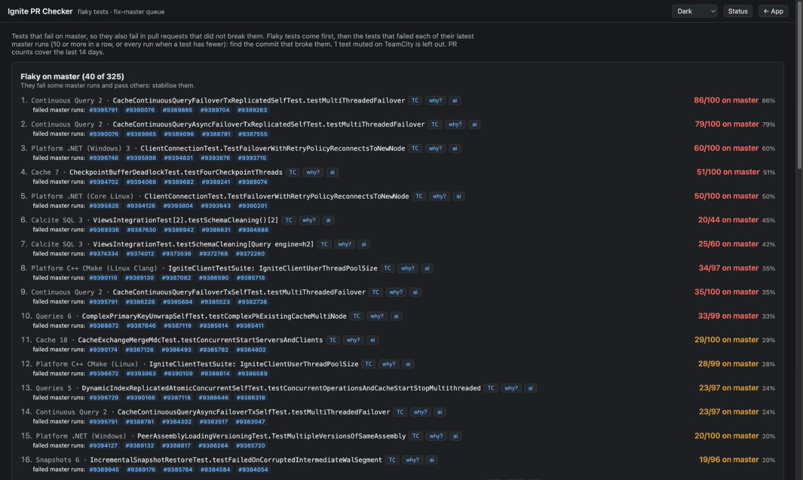
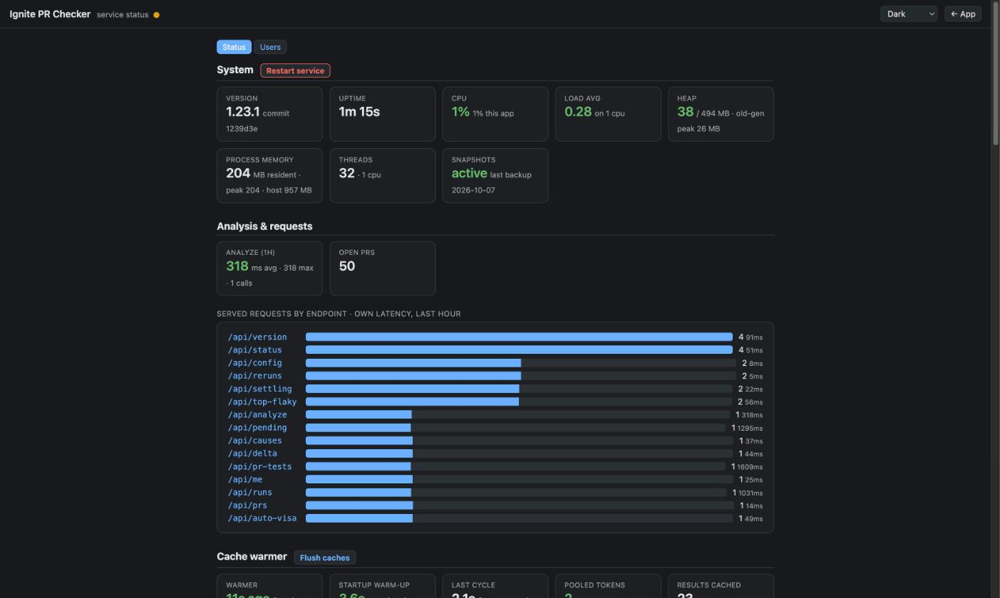

# Тур по возможностям

[English](features.md) · **Русский**

Что умеет Ignite PR Checker, экран за экраном. Скриншоты сделаны на рабочем инстансе в теме Dark; в селекторе в шапке
четыре темы: Light, Dark, JetBrains и Terminal.

## Словарь вердикта

Каждая метка, которую чекер ставит на PR, сьюту или тест: что она значит и что делать. Сюда ведут значки **?** на
странице, комментарий в PR и виза в JIRA. Числа — значения по умолчанию из кода, см. [Пороги](#пороги).

### Карточки на странице PR

| Карточка или заголовок | Что значит | Что делать |
|---|---|---|
| **Blockers** | Тесты, которые этот PR, скорее всего, сломал: они падают в его прогонах, и ни master, ни другие PR этого не объясняют. Каждая сьюта оценивается отдельно. Строка под тестом объясняет почему ([причины](#причины-под-тестом)). | Открой **why?** или **TC**, исправь код, запушь, запусти RunAll снова. |
| **Not confirmed: 1 run** | Блокеры, которые упали в единственном своём прогоне на этой ветке. Они всё равно считаются блокерами: в счётчике, в значке списка PR, в визе и в комментарии. | Нажми **Rerun** у их сьют. Второе падение подтверждает блокер, проход снимает его. |
| **Recently started failing** | Тесты, которые падают на текущем коде PR, но прогонов этого кода слишком мало, чтобы отличить поломку от флака. Пока не блокеры. | Нажми **Rerun** у сьюты. Продолжит падать — станет блокером, пройдёт — уйдёт из списка. |
| **Could not be checked** | Упавшие тесты, которые из-за ошибок TeamCity не удалось сравнить с master и веткой. Блокерами не считаются. | Ничего: чекер проверит их снова сам. |
| **Broken suites** | Сьюты без надёжного результата ([причины](#причины-битых-сьют)). Сьюта с таймаутом или падением JVM попадает сюда, а не разбирается на блокеры: её падения — каскад от зависания, и часть тестов не запустилась. | Перезапусти их первыми: вердикт не может доверять тому, что они нашли бы. |
| **Fewer tests than master** | Сьюты, которые прогнали минимум на 10% меньше тестов, чем та же сьюта на master; сравниваются только сьюты, где на master 20 тестов и больше. Незапущенный тест упасть не может. | Если PR удаляет тесты намеренно — ничего. Иначе сравни список тестов с master и перезапусти. |
| **Crashed near the end of the run** | Сьюты, которые упали по таймауту, из-за нехватки памяти или падения JVM, но уже прогнав больше 90% тестов master, и ни одно их падение не вменено PR. Их результаты в силе. | Для PR — ничего. |
| **⚠ Suites that never ran** | RunAll прервали: эти сьюты отменили, и они не запускались. Вердикт о них ничего не говорит. Сьюты, отменённые человеком, свёрнуты в одну строку на человека. | Нажми **Rerun** у них или запусти RunAll снова. |
| **This PR's tests** | Как в этом RunAll прошли тестовые классы, которые PR добавляет (`new`) или меняет (`changed`). Тест попадает в список, если упал, шёл дольше 60 с или, в изменённом классе, не имеет истории на master. | Проверь, что новые тесты запустились и прошли. У теста без истории на master судить можно только по этому прогону. |
| **Filtered out** | Падения, которые не ставятся в вину PR, у каждого своя причина: падает на master, флакает или прошёл на перезапуске. | Для PR — ничего. Тесты, падающие на master, — на доске флаки (`/flaky.html`). |
| **No blockers 🎉** | Прогон покрыл текущий код PR и ничего ему не вменил. В списке PR стоит **✓**. | Можно мержить. |
| **No test blockers** | Ни один тест не вменён, но вердикт не может назвать PR чистым. Красная строка под заголовком говорит почему ([оговорки](#оговорки)); если её нет, на коде PR начали падать тесты, они в карточке **Recently started failing**. | Разберись с тем, что перечислено в красной строке, и перезапусти. Если её нет, нажми **Rerun** у сьют из **Recently started failing**. |

### Причины под тестом

Причина состоит из части про master и части про ветку, через `;`. `N`, `F/R` и `abc1234` — числа и ревизия.
`on JDK 17` значит, что считались только прогоны master на JDK этого PR. Замьюченное падение не показывается
никогда, а прогон, где тест был проигнорирован, прогоном не считается.

| Причина | Что значит | Что делать |
|---|---|---|
| `not seen failing in N master run(s)` | На master тест прогнали в этой сьюте N раз (не больше последних 100), и он ни разу не упал. | Смотри часть про ветку. |
| `not seen failing in only N master run(s) on JDK 17` | То же, но прогонов master на JDK этого PR меньше 10: доводов мало. | Смотри часть про ветку. |
| `no master history (can't prove pre-existing)` | На master нет ни одного прогона теста на JDK этого PR: новый тест или тест, который master не гоняет. Метка `new test / no master history`. | Убедись, что тест стабилен: судить о нём можно только по этому PR. |
| `rare on master: fails F/R, passed the last G` | На master тест падает не чаще чем в 2% прогонов и ни разу в последних 10, а падений подряд в PR слишком много для такой случайности. | Считай блокером. |
| `fails F/R on master at TEST_SCALE_FACTOR=1.0, but f/r on other PR branches at 0.1` | На master тест падает минимум в половине прогонов, но только на масштабе, с которым этот PR не гоняли. В других PR, прогнанных так же, он падает редко, а падений подряд в этом PR слишком много для их частоты. | Считай блокером. |
| `…; fails F/R in K other PRs` (у блокера) | Тест падает ещё в 3 и более других PR, но падений подряд в этом PR слишком много для такой флакучести. | Считай блокером. |
| `failed all N runs on this branch`, `failed the last N of M runs on this branch` | Последние 3 завершённых прогона сьюты на ветке уронили тест, или все прогоны, если их меньше. Блокер. | Исправь код. |
| `failed the only run on this branch` | Тест прогнали на ветке один раз, и он упал. Блокер с меткой `1 run`. | Нажми **Rerun** у сьюты, чтобы подтвердить. |
| `failed all N runs on revision abc1234` | Все прогоны текущего кода PR уронили тест, и их было минимум 2. Блокер. | Исправь код. |
| `first failure on revision abc1234 — watch (nothing has passed on this code; …)` | Текущий код прогнали один раз, и тест упал; прежние прогоны были на старом коде. Под наблюдением. | Нажми **Rerun** у сьюты. |
| `started failing in the last N of M runs on revision abc1234 — watch (an earlier run on the same code passed)` | Минимум 2 падения подряд на текущем коде после прохода на том же коде. Под наблюдением. | Нажми **Rerun** у сьюты. |
| `… — watch (too few failures on this code yet to outweigh other PRs)` | Случай с масштабом выше, но падений пока мало, чтобы перевесить частоту в других PR. Под наблюдением. | Нажми **Rerun** у сьюты. |
| `pre-existing: fails F/R on master` | Тест падает и на master. В отсеве. | Для PR — ничего. |
| `flaky on other PR branches: fails F/R in K other PRs; …` | Тест падает в 3 и более других PR, и падений в этом PR не хватает, чтобы это перевесить. В отсеве. | Для PR — ничего. |
| `flaky on branch: failed only the latest of N runs on revision abc1234 (an earlier run on the same code passed)` | Тест упал один раз после прохода на том же коде. В отсеве. | Ничего или перезапусти для верности. |
| `not failing in the last finished run (passed on re-run)` | Последний завершённый прогон теста на ветке прошёл. В отсеве. | Ничего. |
| `could not verify (TeamCity error: …)` | Проверку оборвала ошибка TeamCity. Тест в карточке **Could not be checked**. | Ничего: проверка повторится. |
| `(the N earlier branch runs ran on other code)` | Прогоны на старой ревизии не считаются; в полоске они бледные. | — |
| `(passed just before, but TeamCity gave no revisions to prove that was the same code)`, `(… could not be placed on a revision)` | TeamCity не дал ревизию части прогонов, и сравнить их не удалось. | — |

### Оговорки

Красная строка под **No test blockers** и список под «This run doesn't cover the PR fully» в комментарии и визе.

| Оговорка | Что значит | Что делать |
|---|---|---|
| `Build failed — N suites that need it did not run` | Упал прогон, который нужен остальным сьютам, и они не запускались. | Почини сборку, запушь, запусти RunAll снова. |
| `the RunAll was interrupted — N suite(s) never ran` | Сьюты отменили до запуска. | Нажми **Rerun** у них или запусти RunAll снова. |
| `N suite(s) have no reliable result (…)` | Битые сьюты; причины в скобках. | См. [причины битых сьют](#причины-битых-сьют). |
| `N suite(s) ran far fewer tests than the same suites on master` | См. **Fewer tests than master**. | Сверь списки тестов, перезапусти. |
| `N failed test(s) could not be checked (TeamCity errors)` | См. **Could not be checked**. Виза, комментарий в PR и автоперезапуск ждут повторной проверки до 20 минут, потом идут дальше и перечисляют такие тесты отдельно. | Подожди. |
| `a newer run is still going — its unfinished suites can still fail` | В вердикт подмешан RunAll, который ещё идёт. | Дождись его конца. |
| `N commit(s) pushed since this run — it tested older code` | HEAD PR сдвинулся после прогона. | Запусти RunAll снова. |

### Причины битых сьют

| Причина | Что значит | Что делать |
|---|---|---|
| `compilation error` | Код сьюты не скомпилировался. Кнопки **Rerun** у неё нет: тот же код упадёт так же. | Почини сборку, запушь, запусти RunAll снова. |
| `execution timeout` | Сьюта не уложилась во время. Её падения — скорее всего каскад от зависания, и часть тестов не запустилась. | Перезапусти. Если таймаут повторится, смотри дамп потоков в TeamCity. |
| `JVM crash / out of memory` | JVM упала посреди прогона. | Перезапусти. Если повторится, ищи падение или утечку в логе сборки. |
| `non-zero exit code` | Сборка завершилась с ошибкой, и ни один незамьюченный тест не упал. | Открой **TC** и посмотри, что упало. |
| `failed dependency` | Упал прогон, от которого зависит эта сьюта. | Сначала почини тот прогон. |
| `failed without running tests` | TeamCity не назвал проблему, и ни один тест не упал. | Открой **TC**, перезапусти. |
| `ci2 glitch: artifacts unavailable (N suites)` | ci2 не отдал этим сьютам артефакты нужного им прогона, хотя тот прошёл. | Перезапусти: обычно со второго раза артефакты доходят. |
| `Build failed — N suites that need it did not run; fix the build, then /run-all` | Упал шаг сборки, и сьюты, которым он нужен, не запускались. `nothing else ran` — если в цепочке больше ничего и не было. | Почини сборку, запушь, `/run-all` или **Run**. |
| `Build failed in this run and passed on a re-run since — N suites that need it never ran; /run-all to run them` | Сборка теперь проходит, но у сьют, которым она нужна, нет результата. | `/run-all` или **Run**. |
| `— ran 33 of master's 67 tests` (после причины) | Сколько тестов битая сьюта успела прогнать. Недобор объясняется причиной, а не пропажей тестов. | — |
| что угодно другое | Первая строка текста проблемы от самого TeamCity. | Открой **TC**. |

### Метки у теста

| Метка | Что значит | Что делать |
|---|---|---|
| полоска | Завершённые прогоны теста в его сьюте на ветке, от старых к новым: красный — упал, зелёный — прошёл. Бледные прогоны шли на старом коде и не считаются. | — |
| `flaky?` | Тест упал, а потом прошёл на том же коде. | Ищи гонку или проблему со временем. |
| `1 run` | Вердикт держится на одном падении на этой ветке. | Нажми **Rerun** у сьюты: он подтвердит или снимет. |
| `new test / no master history` | На master нет прогонов теста на этом JDK для сравнения: новый тест или тест, который master не гоняет. | Убедись, что тест стабилен. |
| `unverified` | Ошибка TeamCity не дала довести проверку: прогоны теста в других PR. Чекер попробует снова. | Подожди. |
| `⚖ assertion — likely a real logic failure` (в **why?**) | Не прошла проверка. | Исправь код. |
| `♻ environment/timing — a re-run may pass` | Проблема окружения или времени. | Перезапусти. |
| `♻ environment/timing — but it failed all N runs of this code, …` | То же, но упали все прогоны этого кода. | Один перезапуск вряд ли поможет: чини. |
| `⌛ hang — the test ran out of time; …` | Тест завис. Показан его поток из дампа потоков. | Посмотри, чего этот поток ждёт. |
| **why?** / **ai** | Текст падения / промпт для ассистента-кодера, копируется в буфер обмена. | — |

### Значки в списке PR

| Значок | Что значит | Что делать |
|---|---|---|
| красное число | Блокеры в последнем разобранном RunAll этого PR. | Открой PR. |
| **!** | Блокеров нет, но на его коде начали падать тесты. | Решит перезапуск. |
| **?** | Блокеров не нашлось, но прогон не может доказать, что PR чист ([оговорки](#оговорки)), после прогона запушили коммиты или неизвестно, тестировал ли прогон текущий HEAD PR. | Открой PR, там написана причина. |
| **✓** | Чистый прогон текущего HEAD PR. | — |
| нет значка | PR ещё не разобран. | Открой PR, чтобы разобрать. |
| **My?** | Последний RunAll запустил твой пользователь TeamCity. | — |

### Прогоны, кнопки и визы

| Метка | Что значит | Что делать |
|---|---|---|
| `queued`, `running` | Сборка этого PR на ci2 прямо сейчас. Время рядом — сколько она уже ждёт или идёт; `~14m left` и `starts ~5m` — оценки по очереди и прогрессу сьюты. | — |
| `rev ✓ head` | Прогон тестирует текущий HEAD PR. | — |
| `⚠ rev abc1234` | Коммиты запушили после старта прогона: он тестирует старый код. | Когда это важно, запусти RunAll снова. |
| `rev @start` | Прогон ещё в очереди; страница назовёт его ревизию, когда он запустится. | — |
| `by alice` | Этот прогон запустил кто-то другой. **Cancel my runs** его не трогает. | — |
| `● includes an unfinished run` | В вердикт подмешаны завершённые сьюты RunAll, который ещё идёт. Такой вердикт никогда не бывает зелёным. | Дождись конца прогона. |
| `suites: 6 fresh, 141 from earlier runs` | Сколько сьют цепочки прогнали, а сколько TeamCity взял из прежних прогонов на тех же ревизиях. | — |
| `vs previous run: +2 new · −3 fixed · 5 persisting` | Блокеры в сравнении с предыдущим RunAll этого PR, по сьютам. | — |
| `⚠ N new commits pushed since this run` | Вердикт про старый код. | **Run RunAll**. |
| `♻️ Auto re-run #1 of up to 2 in progress`, `♻️ Deciding on auto re-runs…` | Автоперезапуски ещё уточняют этот прогон: вердикт может измениться. | Подожди. **🔔 Notify me** скажет, когда он окончательный. |
| **Run**, **Run at top** | Поставить новую цепочку RunAll для PR в конец или в голову очереди ci2. Всегда спрашивает. | — |
| **Rerun**, **Rerun at top** | Перезапустить сьюту или все сьюты секции (число — сколько). От пяти сьют спрашивает. | — |
| **Cancel my runs** | Отменяет сборки, которые ты запустил в этом PR. | — |
| **JIRA visa** | Сразу постит вердикт в тикет IGNITE, названный в заголовке PR. | — |
| **Auto visa** | Один раз постит вердикт текущего прогона в тикет, когда он закончится. `Auto visa ✓` — включил ты; `armed: bob` — включили другие, и на всех будет одна виза. | — |
| **Auto visa: on in ⚙** | Визу запостит постоянная автовиза того, кто запустил прогон: включать нечего. | — |
| **Auto-visa all my runs** (⚙) | Когда твой RunAll заканчивается, его вердикт уходит в тикет IGNITE, названный в заголовке PR, один раз на прогон; если включён и автоперезапуск — когда перезапуски улягутся. В заголовке нужен ключ IGNITE-NNNN: нет ключа — нет визы. Пока идёт более новый RunAll этого PR, визы нет, и чекер не повторяет прошлую визу той же ревизии. | — |

### Пороги

| Что | По умолчанию | Где видно |
|---|---|---|
| Сколько прогонов master смотреть на тест в сьюте | 100 (`MASTER_HISTORY_DEPTH`) | `pre-existing`, `not seen failing in N master run(s)` |
| Сколько падений подряд на ветке дают блокер | 3, или все прогоны, если их меньше (`BLOCKER_FAIL_STREAK`) | `failed all N runs on this branch` |
| Мало истории на master | меньше 10 прогонов master на JDK этого PR | `only N master run(s)` |
| Редкое падение на master | не больше 2% прогонов master и ни одного в последних 10 | `rare on master` |
| Слишком много падений для случайности | вероятность не больше 1 к 10 000: 2 подряд против 1%, 3 против 2%, 5 против 12,5% | `rare on master`, причины про другие PR и масштаб |
| Флаки в других PR | падает в 3 и более других PR | `flaky on other PR branches` |
| Падения master списываются на масштаб | master падает минимум в половине прогонов, только на другом масштабе, а в других PR прогонов минимум 10 | `fails F/R on master at TEST_SCALE_FACTOR=1.0` |
| Меньше тестов, чем на master | минимум на 10% меньше, для сьют с 20 и более тестами на master | **Fewer tests than master** |
| Упавшая сьюта, чьи результаты в силе | прогнала больше 90% тестов master | **Crashed near the end of the run** |
| Сколько придерживают неполный вердикт | 20 минут | **Could not be checked** |
| Медленный тест PR | дольше 60 с | **This PR's tests** |
| Перезапуск, который спрашивает | 5 сьют | **Rerun (N)** |

## Найти свой PR

- Левая панель — открытые PR репозитория, свежеобновлённые сверху. У каждого значок с последним известным вердиктом
  ([значки](#значки-в-списке-pr)), а легенда под фильтром их повторяет. **My?** отмечает PR, чей последний RunAll
  запустил ты.
- Фильтр (**Filter, or a PR number**) сужает список по номеру или заголовку. Номер, которого в списке нет,
  предлагается как **Open PR #N →**. `Enter` открывает его или первое совпадение, `Escape` очищает фильтр, а `/`
  переводит в него из любого места страницы.
- Каждый PR в списке — ссылка (`?pr=13655`), так что средний клик открывает его в новой вкладке. В адресе работает
  любой номер PR, в том числе того, которого нет в списке.
- Ширину панели меняет перетаскивание разделителя, двойной клик по нему её сбрасывает, а `‹` / `›` сворачивают
  панель. На экране уже 768 px список сворачивается, когда открывается PR.

## Прочитать вердикт

Страница отвечает на один вопрос: какие тесты сломал этот PR? [Карточки](#карточки-на-странице-pr) идут от того, что
делает прогон ненадёжным (сьюты, которые не запускались, битые сьюты, меньше тестов, чем на master), к блокерам,
тестам под наблюдением и отфильтрованному шуму.

- **Шапка** называет PR, даёт ссылки на него в GitHub и на тикет IGNITE в JIRA и держит кнопки RunAll. Строка под ней
  начинается с ↻, которая пересчитывает вердикт сейчас, дальше — разобранная сборка со ссылкой TC, когда закончился
  прогон (янтарным, если ему больше недели), когда посчитан вердикт и из чего состоит прогон:
  `suites: 147 fresh, 0 from earlier runs`.
- **Плашки** под шапкой говорят, что после прогона были пуши, что автоперезапуски ещё доводят прогон, а у
  смерженного PR — что это вердикт на момент мержа. Вердикт смерженного PR хранится и не пересчитывается: история
  master теперь содержит собственные прогоны этого PR.
- **Какой прогон.** Чекер разбирает самый свежий завершённый и не отменённый RunAll этого PR; если такого нет — самый
  свежий отменённый; если нет и его — тот, что ещё идёт. Завершённые сьюты идущей цепочки — настоящие результаты, так
  что первый RunAll PR показывает падения за часы до своего конца. Пока идёт более новый RunAll, его завершённые сьюты
  вливаются в вердикт с пометкой `● includes an unfinished run`. Такой вердикт никогда не бывает зелёным, а визы и
  комментарии в PR ждут завершённую цепочку.
- **Перезапуски считаются.** Сьюта, перезапущенная отдельно, руками или автоперезапуском, входит в вердикт, если её
  прогон новее прогона этой сьюты в цепочке. Проход на перезапуске снимает блокер; битая сьюта, чей полный перезапуск
  не сломался, оценивается по этому прогону.
- **Каждая сьюта отдельно.** Один тест может идти в нескольких сьютах (тесты C++ идут на Windows, Linux и Clang). Он
  указан в каждой сьюте, где упал, с вердиктом этой сьюты, так что проход на Windows не прячет устойчивую поломку на
  Linux.
- **Тот же код, тот же JDK.** Каждый прогон сверяется с ревизией, которую он собрал: проход на старом коде падение не
  снимает, и такие прогоны приглушены в полоске теста. Прогоны master считаются только на JDK прогона PR. Прогон, в
  котором тест был проигнорирован, — не прогон, а падение, замьюченное в TeamCity, никогда не попадает в список.
- **Полоска** рядом с тестом показывает его завершённые прогоны в этой сьюте на ветке, от старых к новым. Проход после
  падения на том же коде даёт метку `flaky?`.
- **Битые сьюты** сгруппированы по причине. Первым идёт упавший Build вместе со сьютами, которым он нужен и которые не
  запустились. Потом сбой артефактов ci2, потом остальное по тексту проблемы из TeamCity. У группы одна кнопка
  **Rerun** на все её сьюты; сьюта, которая не скомпилировалась, её не получает: тот же код упадёт так же.
- **У блокеров** два вида: **Suites** и **Root causes** — те же блокеры, сгруппированные по сигнатуре падения. Число
  причин в заголовке появляется, когда кто-то уже открыл Root causes для этих блокеров. Блокеры, для чьих падений
  TeamCity больше не хранит сообщение, там перечислены отдельно, с подсказкой перезапустить их сьюты.
- **This PR's tests** показывает, как прошли тестовые классы, которые PR добавляет или меняет: каждый класс с числом
  прошедших, упавших и проигнорированных тестов и самым долгим тестом, а также тесты, которые упали, шли дольше 60 с
  или, в изменённом классе, не имеют истории на master.
- **No blockers 🎉** появляется только у вердикта, которому список PR ставит галочку: прогон текущего head этого PR,
  который покрыл всё и ничего ему не вменил. Иначе страница пишет **No test blockers**, а красная строка под ним
  перечисляет оговорки теми же словами, что комментарий в PR и виза.
- **why?** раскрывает сообщение о падении и стектрейс с грубой меткой триажа: `⚖ assertion …`,
  `♻ environment/timing …` или `⌛ hang …`. Вывод длиннее 32 000 символов обрезается; целиком он остаётся в TeamCity.
- **ai** копирует промпт для ИИ-ассистента: PR, сьюта и её прогон, тест, вердикт чекера с причиной, метка триажа,
  вывод падения и как воспроизвести его на коммите, который проверял прогон, с шагами для Java, .NET или C++ по сьюте.
  Всё, что процитировано из PR, помечено как данные, а не инструкции, и промпт просит запускать код PR в изолированной
  среде. У корневых причин, битых сьют и сьют с меньшим, чем на master, числом тестов свои промпты **ai**.
- **Вкладка** показывает в заголовке и значке, как идёт прогон: `⏱ ~1h 05m left`, `♻️ re-run 1/2`, потом
  `❌ 3 blockers`, `✅ no blockers` или `⚠ no test blockers`. **🔔 Notify me** присылает одно уведомление на рабочий
  стол, когда вердикт окончательный; вкладка должна оставаться открытой.

## Итерации над фиксом

- **vs previous run**: `vs previous run: +2 new · −3 fixed · 5 persisting` — блокеры в сравнении с предыдущим
  RunAll этого PR (имена тестов в подсказках), рядом тренд: по столбику на прогон, красный, пока блокеры есть. Блокер —
  это тест в сьюте, так что тест, исправленный на Linux, считается исправленным там, даже если на Windows ещё падает.
- **Run** и **Run at top** ставят новый RunAll этого PR в конец или в начало очереди ci2. Они всегда сначала
  спрашивают и называют размер цепочки. Если твой RunAll этого PR ещё идёт, OK отменяет его и ставит новый; чужой
  RunAll остаётся.
- **Rerun** и **Rerun at top** перезапускают одну сьюту, все сьюты раздела или группу битых сьют; кнопки раздела
  называют число сьют. С 5 сьют они сначала спрашивают. Твой одинаковый перезапуск, который ещё в очереди,
  заменяется; чужой остаётся.
- **Строка прогонов** перечисляет сборки PR в очереди и в работе: сколько каждая ждала или шла, оценку
  (`~14m left`, `starts ~5m`), метку ревизии (`rev ✓ head`, `⚠ rev abc1234`, `rev @start`) и `by alice` у чужого
  прогона. Те же плашки появляются у сьют, которые они перезапускают.
- **Cancel my runs** видна, только пока у тебя есть прогон на этом PR. Она перечисляет твои прогоны, спрашивает и
  отменяет только их.
- **Пуши после прогона**: плашка пишет
  `⚠ 7 new commits pushed since this run (0013263 → b52666a) — the verdict is for the older code.`, рядом — кнопка
  **Run RunAll**.
- Когда твоя цепочка или перезапуск заканчивается, страница показывает новый вердикт без перезагрузки.

## Постоянные опции

Панель ⚙ держит опции, которые действуют, пока страница закрыта, на цепочках RunAll, которые запускаешь ты: на
странице, комментарием `/run-all` или в TeamCity. Опция не действует задним числом: прогоны, закончившиеся до её
включения, она не трогает. Каждая, пока включена, хранит нужные ей токены зашифрованными.

- **Auto re-run failed suites on my runs** перезапускает сьюты, которые вменяет вердикт: блокеры, тесты под
  наблюдением и битые сьюты. Сьюта, упавшая, пока цепочка ещё идёт, перезапускается сразу, в начале очереди, до 10 на
  цепочку. После конца цепочки перезапускаются сьюты, которые всё ещё вменены: до 2 волн на прогон, причём
  перезапуски по ходу цепочки считаются первой; до 10 сьют идут в начало очереди, больше — в хвост. Если таких сьют
  больше 30, а перезапусков ещё не было, ничего не перезапускается: это похоже на системную поломку. Одинаковые сьюты,
  уже стоящие в очереди, сначала отменяются. Упавший Build перезапускается один; сьюты, которые не скомпилировались, и
  сьюты, которые не запустились из-за упавшего Build, не перезапускаются никогда.
- **Auto-visa all my runs** отправляет вердикт в тикет IGNITE, названный в заголовке PR, один раз на прогон, после
  того как перезапуски устоялись. В заголовке нужен ключ вида `IGNITE-12345`, в любом регистре: нет ключа — нет визы.
  Пока идёт более новый RunAll этого PR, визы нет, и нет визы, которая повторяет прошлую для той же ревизии. Нужен
  твой токен JIRA.
- **Comment my runs' verdicts on the GitHub PR** публикует тот же вердикт комментарием от твоего аккаунта GitHub, один
  раз на прогон, после того как перезапуски устоялись. Нужен классический токен GitHub со scope `public_repo`.
- **PR commands** позволяет запускать RunAll комментарием в PR ([команды](#работа-из-pr-команды)). Опция хранит
  только твой логин GitHub и токен TeamCity; сама по себе она не отдаёт токен никакой фоновой работе. Привязка логина
  GitHub включает её.
- **Auto-fix checkstyle on my runs**: когда ты командуешь прогон в своём PR, механически исправимые нарушения в
  изменённых файлах (импорты, пробелы, порядок модификаторов…) исправляются и пушатся до старта прогона одним коммитом
  от твоего аккаунта с заголовком `Checkstyle autofix by Ignite PR Checker (requested via PR command)`. Комментарий с
  командой называет коммит, напоминает сделать `git pull` и перечисляет, что осталось человеку (javadoc, имена,
  переносы). Опция использует тот же токен GitHub и работает с PR, где до 50 изменённых Java-файлов; файл больше
  400 КБ или сверх 5 МБ в сумме не проверяется. Чужие PR она не трогает и никогда не делает force-push.
- **Токен перестал работать.** Когда GitHub или JIRA отвергает хранимый токен, чекер его удаляет и выключает опции,
  которым он нужен; панель говорит, какой токен заменить. Когда TeamCity отвергает твой, твои опции встают на паузу,
  пока ты не войдёшь со свежим токеном; чужие не останавливаются.

## Визы и комментарии в PR

- **JIRA visa** над блокерами отправляет вердикт в тикет IGNITE сейчас. **Auto visa** отправляет вердикт идущего
  прогона в тикет, когда он закончится, один раз. Каждый пользователь взводит свою, а несколько пользователей,
  взведших визу на один тикет, получают одну визу на всех. Если у того, кто запустил прогон, включена **Auto-visa all
  my runs**, кнопка пишет **Auto visa: on in ⚙**.
- Токен JIRA для этих кнопок лежит в cookie твоей сессии; для Auto visa сервер ещё хранит его зашифрованным, пока виза
  не отправлена.
- Виза и комментарий в PR говорят одно и то же. Первая строка называет сборку RunAll, проверенный коммит и сколько
  сьют прогнано и сколько взято из прошлых прогонов. Битые сьюты сгруппированы по причине.
- Списки блокеров, тестов под наблюдением и непроверенных тестов сгруппированы по сьюте и классу, самая большая
  группа первой. В каждой строке метки теста (`1 run`, `new test / no master history`, `unverified`) и ссылка TC, а
  строка под списками объясняет метки. Комментарий в PR показывает 5 групп и сворачивает остальные; виза — 10.
- Вердикт, который не может назвать PR чистым, перечисляет оговорки. Вердикт кода, поверх которого уже запушили,
  говорит, какую ревизию он проверял и какой head у PR сейчас. Красный комментарий в PR кончается строкой **Next:**:
  исправь, запушь и `/run-all`.
- Каждый вердикт кончается ссылкой на [словарь вердикта](#словарь-вердикта).
- Когда более новый RunAll этого PR закончился, каждый старый комментарий с вердиктом в PR получает последнюю строку:
  он устарел, и вот где новый вердикт.

## Работа из PR (команды)

Весь цикл, от старта до вердикта, может пройти в pull request. Включи **PR commands** в ⚙ и привяжи логин GitHub;
собственный токен GitHub не обязателен.

| Команда | Что делает |
|---|---|
| `/run-all` (или `/runall`) | Ставит всю цепочку RunAll под твоим собственным аккаунтом TeamCity. |
| `/run-all top` (или `--top`) | То же, но в начало очереди ci2. |
| `/top` | Двигает RunAll, который запустил твой `/run-all` в этом PR, в начало очереди, пока тот ещё ждёт. |

- Команда должна быть первым словом комментария. Команды подхватываются в течение минуты, в любом pull request.
  Комментарий, написанный больше часа назад, не выполняется, даже если его потом отредактировали.
- 🚀 — принято, 😕 — отказ. Подробности дописываются в твой комментарий с командой: поставленная сборка, затем
  `⏱ Queued — expected to finish ≈ 21:05 MSK` в часовом поясе твоего профиля JIRA, без него — в UTC. Комментарий
  правится, когда меняется стадия или оценка сдвигается на 10 минут и больше.
- Когда у чекера есть твой токен GitHub (для комментария в PR или автоисправления), реакции и рассказ идут от твоего
  аккаунта GitHub; иначе — от аккаунта приложения.
- После конца цепочки рассказ показывает волны перезапусков (`♻️ Auto re-run #2 — 3 broken suite(s), ≈ settled by 22:21`)
  и кончается строкой `🏁 Run finished — see the verdict` со ссылкой на твой комментарий с вердиктом или на страницу
  чекера. Если за тебя рассказывает аккаунт приложения, он ещё и упоминает тебя в новом комментарии, когда вердикт
  готов.
- Команда не первым словом («Please /run-all») получает 😕 и подсказку, как её написать. Отказ `/top` или упавший
  `/run-all` объясняют причину словами.
- Новый `/run-all` заменяет твой предыдущий: твоя цепочка этого PR в очереди или в работе и её перезапуски сначала
  отменяются, чужие — нет. Старый рассказ кончается строкой `🛑 Superseded by a newer /run-all`, а подтверждение
  говорит, что было отменено.
- Команда от того, у кого PR commands выключены, получает 😕 и короткий ответ от аккаунта приложения, как их
  включить: один раз на человека, один раз на PR, не больше 5 ответов в сутки.

## Очередь «чинить мастер» (`/flaky.html`)

- Тесты, которые чекер отфильтровывает, потому что они падают на master: это не вина какого-то PR, но они падают в
  PR, которые их не ломали. Первой идёт группа **Flaky on master**: тесты, которые в одних прогонах master падают, а в
  других проходят. За ней **Broken on master**: тесты, которые упали в каждом из своих последних 10 прогонов master
  или во всех, если прогонов было меньше.
- Каждая группа отсортирована по частоте падений на master, потом по числу PR, в которых тест падал за последние 14
  дней, и показывает не больше 40 строк.
- Тест, который идёт в нескольких сьютах, получает строку на каждую сьюту, с частотой падений и упавшими прогонами
  master именно этой сьюты.
- Тесты, замьюченные в TeamCity, не показываются, и вступление говорит, сколько их.
- Счёт переживает перезапуски; тест уходит с доски через 14 дней после того, как его падение видели последний раз.
- Доску может читать кто угодно; **why?** требует входа. **ai** собирает промпт, чтобы стабилизировать флакующий тест
  или найти коммит, который сломал сломанный. У сьюты, которую перезапускают, видна плашка: PR, состояние и оценка.

## Страница статуса (`/status.html`)

- Кто угодно видит версию и её коммит, аптайм, CPU и нагрузку, кучу с пиком старого поколения, память процесса,
  снапшоты, задержку каждого эндпоинта, прогрев кэша, наблюдатель сборок и вызовы TeamCity, GitHub и JIRA по
  категориям за последний час.
- Точка здоровья рядом с заголовком краснеет на 6 часов после ошибки и желтеет на час после предупреждения. Она
  также краснеет или желтеет, когда останавливается фоновая задача (постоянный обход, опрос PR-команд, цикл прогрева),
  не удалось прочитать файл состояния или настройка вне диапазона; такие проблемы перечислены сверху. Запросы, которые
  Spring отклоняет как ошибку вызывающего, показаны серым и точку не красят.
- Раздел GitHub показывает аккаунт приложения: чей это `GITHUB_TOKEN`, с предупреждением, если этот аккаунт может
  пушить в репозиторий.
- Вошедшие видят ещё сообщения лога, действующие настройки и кто последним перезапускал и сбрасывал кэши. Те, кому
  можно управлять сервисом (`PRC_ADMINS`, или любой вошедший, если он не задан), получают ещё **Restart service**,
  **Flush caches** и список на вкладке **Users**.

## Всё остальное

- **Обновление**: когда выходит новый релиз, в шапке появляется **Update to vX.Y.Z** и ссылка **what's new** на его
  заметки. После выкладки открытые вкладки показывают **UI updated — reload**.
- **Свой вход**: каждый входит со своим токеном TeamCity, который хранится зашифрованным в HttpOnly-cookie.
  Серверного хранилища сессий и общего аккаунта TeamCity нет. Токен, отозванный в TeamCity, возвращает тебя к форме
  входа.
- **Четыре темы**: Light, Dark, JetBrains (плотная, с полосками статусов) и Terminal (моноширинная, кнопки в
  скобках). Выбор хранится в браузере, без мигания при загрузке.
- **Прогрев**: тяжёлая работа кэшируется и заранее прогревается в фоне, так что PR обычно открывается сразу.
  Сервисного аккаунта нет: прогрев идёт на токенах TeamCity настоящих пользователей. Каждый запрос вошедшего
  пользователя отдаёт свой, и любая **standing-опция**, кроме одних PR commands, держит твой токен в пуле, пока она
  включена, — это и держит фоновую работу (прогрев, повторный разбор завершённого прогона, живые состояния прогонов),
  пока страницу никто не открыл.
